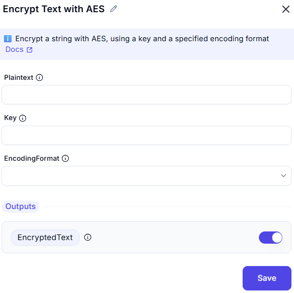

# Encrypt Text with AES

## Description

This screenshot demonstrates an interface for encrypting text using the **AES (Advanced Encryption Standard)** algorithm. Users can input the text, specify an encryption key, and configure advanced settings such as encoding, salt, and initialization vector (IV).

---

## Input Section

### Encoding
- **Selected Option**: `Unicode`
- **Description**: Defines how the input text is encoded before encryption. `Unicode` ensures compatibility with a wide range of characters.

### Text to Encrypt
- **Field**: *(Empty in the screenshot)*
- **Description**: The actual plain text string you want to encrypt.

### Encryption Key
- **Field**: *(Empty in the screenshot)*
- **Description**: A secret key used to perform the AES encryption. It must be kept safe and secure, as it's required for decryption too.

---

### Advanced Settings

- **Salt**: Optional field to add a salt value for additional security.
- **Initialization Vector (IV)**: Optional field to specify an IV for the encryption process.

---

## Output

- **EncryptedText**: The resulting encrypted text.
- **Salt**: The salt value used (if provided).
- **InitializationVector**: The IV used (if provided).

---

## Summary

This tool is useful for securely encrypting text using the AES algorithm. It provides options for encoding, encryption key input, and advanced settings like salt and initialization vector for enhanced security.