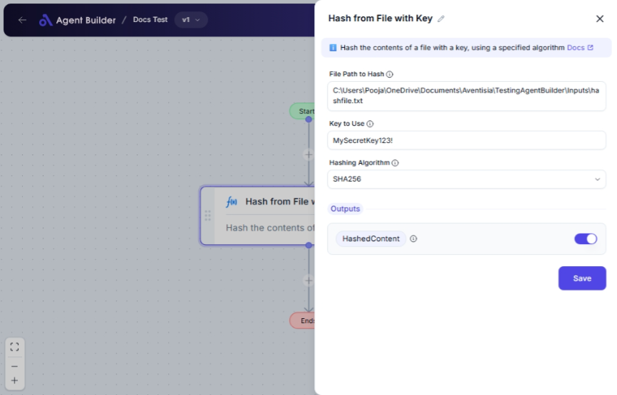

import { Callout, Steps } from "nextra/components";

# Hash from File with Key

The **Hash from File with Key** node allows you to create a secure hash of a file using a specified key and hashing algorithm. This is ideal for securing file contents or verifying file integrity and authenticity.

Applications include:

- Creating a digital fingerprint for files.
- Ensuring data integrity in files sent across networks.
- Verifying file authenticity before processing.

## Configuration Options

| Field Name            | Description                                                        | Input Type | Required? | Default Value |
| --------------------- | ------------------------------------------------------------------ | ---------- | --------- | ------------- |
| **File Path to Hash** | The path to the file you want to hash.                             | Text       | Yes       | _(empty)_     |
| **Key to Use**        | The key to use in hashing the file content.                        | Text       | Yes       | _(empty)_     |
| **Hashing Algorithm** | The algorithm for hashing (choose between SHA256, SHA512, or MD5). | Select     | Yes       | _(empty)_     |

## Expected Output Format

The output of this node is the **hashed file content represented as a string**. This is stored in a variable called **HashedContent**.

## Step-by-Step Guide

<Steps>
### Step 1

Add the **Hash from File with Key** node into your flow.

### Step 2

In the **File Path to Hash** field, input the path to the file you need to hash.

### Step 3

Enter the key in the **Key to Use** field. This key adds security to the hashing process.

### Step 4

Select the hashing algorithm from the **Hashing Algorithm** dropdown based on your requirements:

- **SHA256**
- **SHA512**
- **MD5**

### Step 5

The hashed result will be stored in **HashedContent**, which you can use in subsequent nodes.

</Steps>

<Callout type="warning" title="Important">
  Ensure the file path is accurate and accessible to avoid errors when hashing.
</Callout>

## Input/Output Examples

| File Path         | Key         | Algorithm | Output (HashedContent)               | Output Type |
| ----------------- | ----------- | --------- | ------------------------------------ | ----------- |
| /path/to/file.txt | mySecretKey | SHA256    | f7a9e54ea5b3195...29c91b (truncated) | String      |
| /path/to/file.txt | anotherKey  | MD5       | 1bc29b36f623ba82aaf6724fd3b16718     | String      |

## Common Mistakes & Troubleshooting

| Problem                  | Solution                                                                         |
| ------------------------ | -------------------------------------------------------------------------------- |
| **Invalid File Path**    | Double-check the file path for typos or connectivity issues.                     |
| **Incorrect Key Usage**  | Ensure you're using the correct and secure key, as this impacts the hash result. |
| **Output Not Generated** | Confirm all required fields are correctly filled and the file is accessible.     |

## Real-World Use Cases

- **Data Security**: Create hashes when sending files to verify they haven't been altered during transmission.
- **Access Control**: Secure documents by hashing with keys, ensuring only authorized users can generate consistent hashes.
- **File Integrity Monitoring**: Use generated hashes to routinely check files for unauthorized changes.
