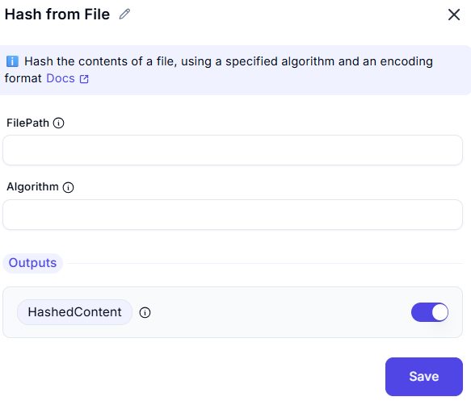

# Hash from File

This screenshot demonstrates an interface for generating a hash value from the contents of a file using a specified hashing algorithm.

---

## Configuration Options

### Algorithm
- Select the hashing algorithm (e.g., SHA-256).

### FilePath
- Choose the file you want to hash.
---
## Output
- The resulting hash value will be generated based on the selected algorithm and encoding.
---
## Summary
This tool is useful for securely generating hash values from file contents using various hashing algorithms like SHA-256. It ensures data integrity and is commonly used in cryptographic applications and file verification.