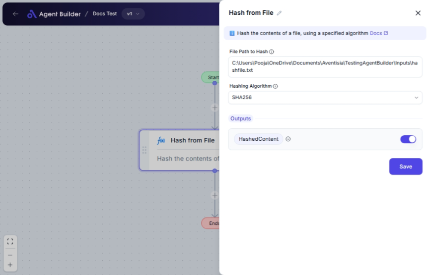

import { Callout, Steps } from "nextra/components";

# Hash from File

The **Hash from File** node allows you to generate a secure checksum for a file by applying a hashing algorithm. Hashes are useful for verifying file integrity and authenticity, ensuring that files have not been altered or corrupted.

Common uses include:

- Confirming file integrity across distributed systems.
- Implementing digital signature workflows.
- Securing sensitive data by creating irreversible hashes for comparison.

## Configuration Options

| Field Name            | Description                                               | Input Type | Required? | Default Value |
| --------------------- | --------------------------------------------------------- | ---------- | --------- | ------------- |
| **File Path to Hash** | The path to the file you want to hash                     | Text       | Yes       | _(empty)_     |
| **Hashing Algorithm** | The algorithm to use for hashing (SHA256, SHA512, or MD5) | Select     | Yes       | _(empty)_     |

## Expected Output Format

The output of this node is a **hashed string**. This string is the result of applying the selected hashing algorithm to your file.

- The resulting hash will be a hexadecimal string.
- Examples:
  - **SHA256** generates a 64-character hash.
  - **SHA512** generates a 128-character hash.
  - **MD5** generates a 32-character hash.

## Step-by-Step Guide

<Steps>
### Step 1

Add **Hash from File** node into your flow.

### Step 2

In the **File Path to Hash** field, enter the path to the file you wish to hash.

### Step 3

Select a **Hashing Algorithm** from the dropdown list:

- **SHA256**: Use for a stronger, more secure hash.
- **SHA512**: Use for an even stronger hash, with additional length.
- **MD5**: Basic hashing, faster but less secure.

### Step 4

The resulting hash will be available as **HashedContent** for use in other nodes or operations.

</Steps>

<Callout type="warning" title="Security Note">
  MD5 is considered less secure than SHA256 and SHA512, especially for
  cryptographic purposes. Prefer using SHA256 or SHA512 except for
  non-security-critical tasks.
</Callout>

## Input/Output Examples

| Algorithm | Input File Path         | Output Hash (example)                                                                                                              | Output Type |
| --------- | ----------------------- | ---------------------------------------------------------------------------------------------------------------------------------- | ----------- |
| SHA256    | `/documents/report.pdf` | `3e23e8160039594a33894f6564e1b1349b2eb00635f6c5aadeec0c9c75bd75c5`                                                                 | Hex String  |
| SHA512    | `/images/photo.jpg`     | `1f40fc92da241694750979ee6cf582f2d5d7d28e18335de05aceed5455c5c331a3ba481d27ddf297d12e59dbd78d4b7a256d6dcf1f7eecf1a9541bb40258f935` | Hex String  |
| MD5       | `/files/document.txt`   | `d41d8cd98f00b204e9800998ecf8427e`                                                                                                 | Hex String  |

## Common Mistakes & Troubleshooting

| Problem                  | Solution                                                                                                          |
| ------------------------ | ----------------------------------------------------------------------------------------------------------------- |
| **File not found error** | Ensure the file path entered is correct and accessible on your machine. Check for typos or incorrect paths.       |
| **Empty hash output**    | Verify that the file is not empty and that the algorithm is properly selected in the **Hashing Algorithm** field. |

## Real-World Use Cases

- **File Transfer Verification**: Use hashes to verify file integrity after transferring between systems.
- **Digital Signatures**: Create hashes of documents to append to digital signatures for authenticity.
- **Version Control**: Hash files to quickly compare versions and spot changes.
- **Data Security**: Store hashed values instead of raw data to protect sensitive information.
