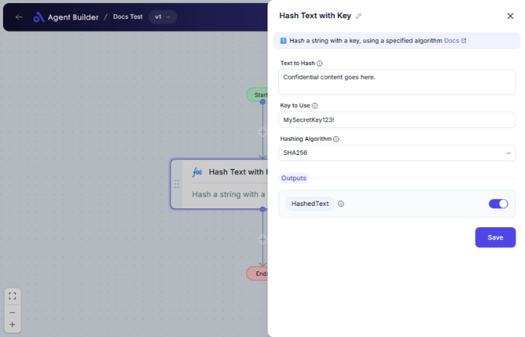

import { Callout, Steps } from "nextra/components";

# Hash Text with Key

The **Hash Text with Key** node enables you to securely convert a piece of text into a hash using a key. This process is often used in cryptography to protect information, verify data integrity, or create unique identifiers for data.

Common scenarios for using this node include:

- Creating secure hashes of messages before transmission.
- Verifying that a message has not been altered by checking its hash.
- Generating unique strings to be used as identifiers for data records.

{/*  */}

## Configuration Options

| Field Name            | Description                                                | Input Type | Required? | Default Value |
| --------------------- | ---------------------------------------------------------- | ---------- | --------- | ------------- |
| **Text to Hash**      | The text you want to hash.                                 | Text       | Yes       | _(empty)_     |
| **Key to Use**        | The key to use in hashing.                                 | Text       | Yes       | _(empty)_     |
| **Hashing Algorithm** | The algorithm to use for hashing (SHA256, SHA512, or MD5). | Select     | Yes       | _(empty)_     |

## Expected Output Format

The output of this node is a **single hashed text value**. This value is a secure representation of your input text combined with the key and selected hashing algorithm.

For example, it might look like a string of letters and numbers of varying length depending on the algorithm, e.g., for SHA256: `d404559f602eab5faa43519217c5aebae7dce0ae`.

## Step-by-Step Guide

<Steps>

### Step 1

Add the **Hash Text with Key** node into your flow.

### Step 2

In the **Text to Hash** field, enter the text string you want to convert into a hash.

### Step 3

In the **Key to Use** field, provide a key that will be combined with the text during hashing. Make sure the key is kept private for security purposes.

### Step 4

Select a **Hashing Algorithm** from the dropdown menu. You can choose from SHA256, SHA512, or MD5 depending on your security needs.

### Step 5

The processed hashed value will be available as **HashedText** for use in further steps or nodes.

</Steps>

<Callout type="warning" title="Security Tip">
  Always use a strong and unique key for hashing to ensure maximum protection.
  Do not use common passwords or known phrases.
</Callout>

## Input/Output Examples

| Input Text      | Key      | Algorithm | Output Hash                              | Output Type |
| --------------- | -------- | --------- | ---------------------------------------- | ----------- |
| Hello World     | MySecret | SHA256    | 7b502c3a1f48c8609ae212cdfb639dee39673f5e | Text        |
| Encryption Test | ABC123   | MD5       | 098f6bcd4621d373cade4e832627b4f6         | Text        |
| Secure Message  | YourKey  | SHA512    | 861844d6704e8573fec34d967e20bcfe6c3ed46e | Text        |

## Common Mistakes & Troubleshooting

| Problem                            | Solution                                                                                      |
| ---------------------------------- | --------------------------------------------------------------------------------------------- |
| **Output is not as expected**      | Double-check the text and key input for typos or unintended characters.                       |
| **Key is not secure enough**       | Ensure your key is unique and contains a mix of letters, numbers, and symbols.                |
| **Hashing Algorithm not selected** | Make sure to select an algorithm from the dropdown before proceeding with the hash operation. |

## Real-World Use Cases

- **Secure Message Transmission**: Hash messages before sending over the network to ensure they have not been altered.
- **Data Verification**: Hash received data and compare it to a known hash to verify integrity.
- **Unique Identifiers**: Create hash-based unique identifiers for records without exposing sensitive data.
