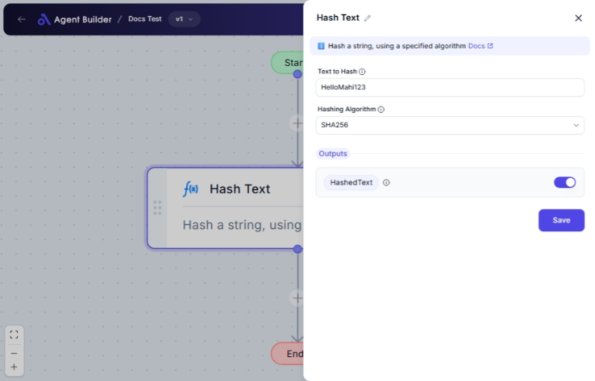

import { Callout, Steps } from "nextra/components";

# Hash Text

The **Hash Text** node allows you to transform any given text into a hash using a selected hashing algorithm. This is useful for securely storing sensitive information, verifying data integrity, or generating unique identifiers. Common scenarios include hashing passwords, ensuring file integrity, or creating data fingerprints.

{/*  */}

## Configuration Options

| Field Name            | Description                                             | Input Type | Required? | Default Value |
| --------------------- | ------------------------------------------------------- | ---------- | --------- | ------------- |
| **Text to Hash**      | The text you want to convert into a hash.               | Text       | Yes       | _(empty)_     |
| **Hashing Algorithm** | The algorithm to use for hashing (SHA256, SHA512, MD5). | Select     | Yes       | _(empty)_     |

## Expected Output Format

The output of this node is a **hashed string**. The format and length depend on the chosen algorithm:

- **SHA256**: Produces a 64-character hex string.
- **SHA512**: Produces a 128-character hex string.
- **MD5**: Produces a 32-character hex string.

## Step-by-Step Guide

<Steps>
### Step 1

Add the **Hash Text** node into your flow.

### Step 2

In the **Text to Hash** field, enter the text you wish to hash. This text can be any string.

### Step 3

Choose the **Hashing Algorithm** you would like to use from the dropdown:

- **SHA256**: Suitable for secure applications.
- **SHA512**: Offers more security than SHA256.
- **MD5**: Faster, but less secure; use only for non-sensitive purposes.

### Step 4

The hashed result will be available as **HashedText** for use in subsequent operations or nodes.

</Steps>

<Callout type="warning" title="Security Note">
  MD5 is not recommended for secure applications as it's vulnerable to attacks.
  Consider using SHA256 or SHA512 for better security.
</Callout>

## Input/Output Example

| Text to Hash     | Algorithm | Resulting Hashed Text                                                                                                              | Output Type |
| ---------------- | --------- | ---------------------------------------------------------------------------------------------------------------------------------- | ----------- |
| "HelloWorld"     | SHA256    | "a591a6d40bf420404a011733cfb7b190d62c65bf0bcda32b03aaee42a2d19982"                                                                 | String      |
| "SensitiveData"  | SHA512    | "3615f80c9d293ed7402687ee7bedba8758a9df6fa1ef3b7d3a34c450194118d88ccbf3971cf8f3164be514a7ba3abc1989f59915ccea438c1e33f6e82b7e0151" | String      |
| "anotherexample" | MD5       | "1c020b5ee35b3f1df120832a2df54f78"                                                                                                 | String      |

## Common Mistakes & Troubleshooting

| Problem                                         | Solution                                                                                 |
| ----------------------------------------------- | ---------------------------------------------------------------------------------------- |
| **Empty Hashed Output**                         | Ensure that both "Text to Hash" and "Hashing Algorithm" fields are filled out correctly. |
| **Incorrect Hash Length**                       | Double-check the selected algorithm as each produces a unique length output.             |
| **Unintended Use of MD5 for Security Purposes** | Avoid using MD5 for sensitive data. Switch to SHA256 or SHA512 for enhanced security.    |

## Real-World Use Cases

- **Password Storage**: Hash user passwords before saving to ensure they cannot be read as plain text.
- **File Integrity Checks**: Generate a hash of files before and after transfer to verify their integrity.
- **Data Fingerprinting**: Create unique identifiers for datasets based on their content for quick comparisons.
