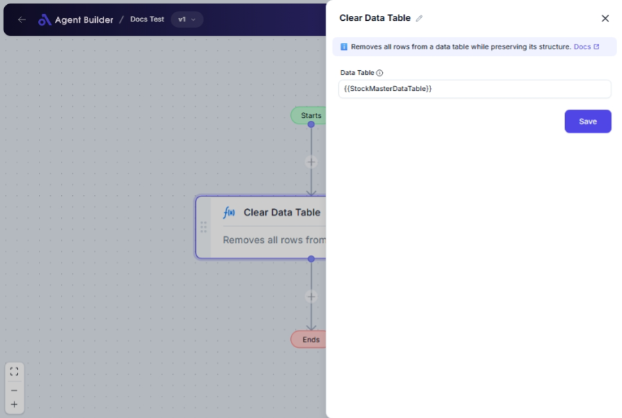

import { Callout, Steps } from "nextra/components";

# Clear Data Table

The **Clear Data Table** node allows you to empty a previously created or assigned table, removing all its contents. This is especially useful when you need to reset data tables between different operations or ensure that subsequent processes start with a clean slate.

For example:

- Preparing a data table for new entries without retaining the old data.
- Clearing temporary tables used in iterative processes.

## Configuration Options

| Field Name     | Description                                                                                      | Input Type | Required? | Default Value |
| -------------- | ------------------------------------------------------------------------------------------------ | ---------- | --------- | ------------- |
| **Data Table** | The data table variable you intend to clear. It needs to be pre-existing or previously assigned. | Text       | Yes       | _(empty)_     |

## Expected Output Format

The output of this node is a **confirmation** that the data table has been cleared. No direct output format or value is provided, as the operation directly affects the state of the specified data table.

## Step-by-Step Guide

<Steps>
### Step 1

Add the **Clear Data Table** node into your flow.

### Step 2

In the **Data Table** field, specify the name of the data table you want to clear.

### Step 3

Proceed with further nodes in the flow once the data table has been cleared as needed.

</Steps>

<Callout type="info" title="Note">
  Ensure the data table specified has been created or assigned earlier in the
  flow, as this node requires an existing table to clear.
</Callout>

## Input/Output Examples

Since the node is designed to clear data, an example of input could be a table named "SalesData" that you wish to reset. Once cleared, "SalesData" will be empty, and no content will be retrievable from it until it is populated again in the workflow.

## Common Mistakes & Troubleshooting

| Problem                                 | Solution                                                                                     |
| --------------------------------------- | -------------------------------------------------------------------------------------------- |
| **Data table name not recognized**      | Verify that the specified data table was previously created or assigned within the workflow. |
| **Data table not clearing as expected** | Check for any processes that might lock or continuously modify the table preventing a clear. |

## Real-World Use Cases

- **Data Reset for Testing**: Quickly remove data from test tables to ensure tests start with a blank state.
- **Control Processes**: Clear tables between iterations in loops where data is reused and must be refreshed.
- **Memory Management**: Free up space by clearing large datasets that are no longer needed after processing.
