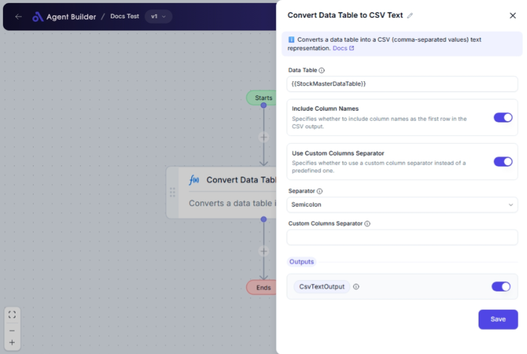

import { Callout, Steps } from "nextra/components";

# Convert Data Table to CSV Text

The **Convert Data Table to CSV Text** node transforms a structured data table into CSV (Comma Separated Values) format. This is especially helpful when you need to share, export, or analyze data using spreadsheet software or other tools that accept CSV files.

For example:

- Exporting a list of sales records from a database into a CSV file for import into accounting software.
- Converting survey responses into a CSV to perform data analysis.
- Creating a backup of records in a portable and widely accepted text format.

## Configuration Options

| Field Name                       | Description                                                                     | Input Type | Required? | Default Value |
| -------------------------------- | ------------------------------------------------------------------------------- | ---------- | --------- | ------------- |
| **Data Table**                   | The data table variable to convert to CSV text.                                 | Text       | Yes       | _(empty)_     |
| **Include Column Names**         | Specifies whether to include column names as the first row in the CSV output.   | Switch     | No        | true          |
| **Use Custom Columns Separator** | Specifies whether to use a custom column separator instead of a predefined one. | Switch     | No        | false         |
| **Separator**                    | The column separator to use in the CSV text.                                    | Select     | No        | SystemDefault |
| **Custom Columns Separator**     | A custom string used to separate columns in the CSV output.                     | Text       | No        | _(empty)_     |

## Expected Output Format

The output of this node is a **CSV text string**. This text can be saved to a file or passed to other nodes for further processing.

- With column names included: Outputs a header row plus each data row.
- Without column names: Outputs only data rows as CSV.
- The CSV is formatted using the system's default separator or a specified/custom separator.

## Step-by-Step Guide

<Steps>
### Step 1

Add **Convert Data Table to CSV Text** node into your flow.

### Step 2

In the **Data Table** field, input the variable representing your data table.

### Step 3

Toggle **Include Column Names** if you want the first row of the CSV to include column headers.

### Step 4

Decide on your separator setting:

- Toggle **Use Custom Columns Separator** to `Yes` if you have a unique separator. Enter your custom separator in the **Custom Columns Separator** field.
- Otherwise, choose one of the predefined separators in the **Separator** dropdown.

### Step 5

The CSV text is available as **CsvTextOutput** for use in other nodes.

</Steps>

<Callout type="warning" title="Separator Choice">
  Be cautious when selecting separators. Ensure it does not exist within the
  data values, as it can cause misalignment issues in the CSV output.
</Callout>

## Input/Output Examples

| Include Column Names | Input Data Table Example                                      | Separator | Output Value Sample           | Output Type |
| -------------------- | ------------------------------------------------------------- | --------- | ----------------------------- | ----------- |
| Yes                  | \[{"{"}"Name":"John","Age":30},{"{"}"Name":"Jane","Age":25}\] | Comma     | Name,Age\nJohn,30\nJane,25    | CSV Text    |
| No                   | \[{"{"}"Name":"John","Age":30},{"{"}"Name":"Jane","Age":25}\] | Semicolon | John;30\nJane;25              | CSV Text    |
| Yes                  | \[{"{"}"Name":"John","Age":30},{"{"}"Name":"Jane","Age":25}\] | Tab       | Name\tAge\nJohn\t30\nJane\t25 | CSV Text    |

## Common Mistakes & Troubleshooting

| Problem                         | Solution                                                                                    |
| ------------------------------- | ------------------------------------------------------------------------------------------- |
| **Data Table field left empty** | Ensure the Data Table field contains a valid data table variable.                           |
| **CSV misalignment**            | Check the separator does not occur in the data values or consider using a custom separator. |
| **Unexpected output format**    | Verify that the separator and Include Column Names settings are configured as desired.      |

## Real-World Use Cases

- **Data Export**: Export user records from a web application into CSV for data cleaning and analysis.
- **Report Generation**: Convert results of a poll into a CSV to summarize responses in a report.
- **Cross-Platform Data Sharing**: Transform local data into a CSV for sharing with partners using different tools.
