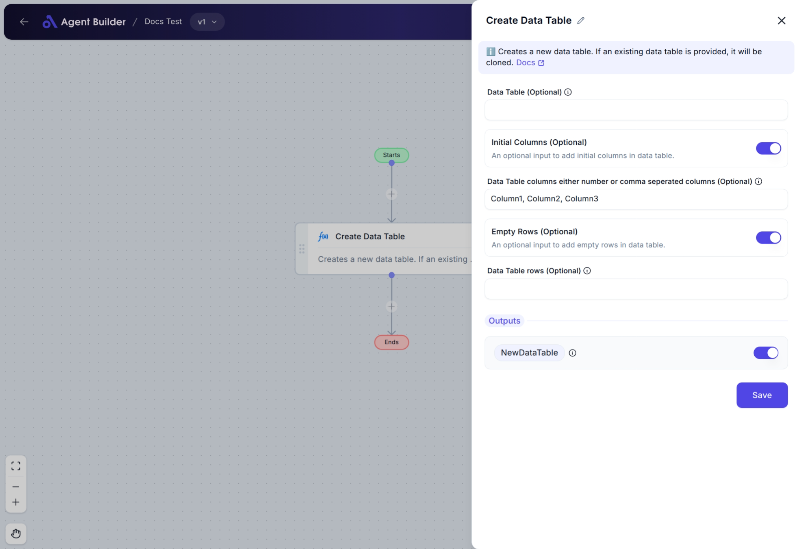

import { Callout, Steps } from "nextra/components";

# Create New Data Table

The **Create New Data Table** node allows you to generate a new data table from scratch or make a copy (clone) of an existing one. This is useful when you want to build a table for storing, processing, or organizing data as part of your automation flow.

You can optionally add columns and empty rows to your new table to prepare it for future data input or processing.

For example:

- Creating an empty table with specific columns ready for data entry.
- Cloning an existing table to use as a starting point for new operations.
- Preparing a table with a certain number of blank rows for future population.

## Configuration Options

| Field Name                                                                 | Description                                                                                                                                                           | Input Type | Required? | Default Value |
| -------------------------------------------------------------------------- | --------------------------------------------------------------------------------------------------------------------------------------------------------------------- | ---------- | --------- | ------------- |
| **Data Table (Optional)**                                                  | A table you want to clone or use as a template for the new table.                                                                                                     | Text       | No        | _(empty)_     |
| **Initial Columns (Optional)**                                             | Enable this to add columns to the new table manually.                                                                                                                 | Switch     | No        | _(empty)_     |
| **Data Table columns either number or comma separated columns (Optional)** | Specify the columns for the new table. You can enter a number (total columns) or list column names separated by commas. _Visible only if Initial Columns is enabled._ | Text       | No        | _(empty)_     |
| **Empty Rows (Optional)**                                                  | Enable this to add empty rows to the new table.                                                                                                                       | Switch     | No        | _(empty)_     |
| **Data Table rows (Optional)**                                             | Specify the number of empty rows to add to the table. _Visible only if Empty Rows is enabled._                                                                        | Text       | No        | _(empty)_     |

## Expected Output Format

The output of this node is a **Data Table** object named **NewDataTable**.

- The output contains either a cloned version of the provided table or a newly created empty table with the specified columns and rows.
- This output can be used as input for other nodes that require table data.

**Output Name**: `NewDataTable`

## Step-by-Step Guide

<Steps>
### Step 1

Add the **Create Data Table** node to your automation flow.

### Step 2

(Optional) In the **Data Table (Optional)** field, provide an existing table to clone. If you want to create a completely new table, leave this empty.

### Step 3

(Optional) Toggle **Initial Columns (Optional)** to **On** if you want to add columns manually.

- When this is enabled, the **Data Table columns** field will appear.
- In the **Data Table columns** field, enter either:
  - A **number** to specify how many unnamed columns to add, or
  - A **comma-separated list of column names** (e.g., `Name, Age, Email`).

### Step 4

(Optional) Toggle **Empty Rows (Optional)** to **On** if you want the table to contain blank rows.

- When this is enabled, the **Data Table rows** field will appear.
- In the **Data Table rows** field, enter the **number of empty rows** you want to add.

### Step 5

The newly created or cloned table will be available as **NewDataTable** for use in other nodes.

</Steps>

<Callout type="info" title="Tip">
  You can skip all optional settings if you only want to create a completely
  empty table without columns or rows.
</Callout>

## Input/Output Examples

| Example Scenario                           | Data Table Input | Initial Columns | Columns Input    | Empty Rows | Rows Input | Output Table (NewDataTable)                                       |
| ------------------------------------------ | ---------------- | --------------- | ---------------- | ---------- | ---------- | ----------------------------------------------------------------- |
| Create empty table                         | _(empty)_        | Off             | _(hidden)_       | Off        | _(hidden)_ | A blank data table with no columns and no rows.                   |
| Clone existing table                       | ExistingTable    | Off             | _(hidden)_       | Off        | _(hidden)_ | A clone of the provided ExistingTable.                            |
| Create table with 3 unnamed columns        | _(empty)_        | On              | `3`              | Off        | _(hidden)_ | A new table with 3 empty columns, no rows.                        |
| Create table with named columns and 5 rows | _(empty)_        | On              | `Name,Age,Email` | On         | `5`        | A table with 3 columns (`Name`, `Age`, `Email`) and 5 empty rows. |

## Common Mistakes & Troubleshooting

| Problem                                              | Solution                                                                                                                                          |
| ---------------------------------------------------- | ------------------------------------------------------------------------------------------------------------------------------------------------- |
| **Columns or Rows fields not visible**               | Make sure the corresponding toggle (**Initial Columns** or **Empty Rows**) is set to **On** to reveal these fields.                               |
| **Entered text instead of a number in Rows/Columns** | If specifying the number of columns or rows, ensure you enter a numeric value. For example: `3`, not `"three"`.                                   |
| **Cloned table does not look as expected**           | Verify that the correct table was provided in the **Data Table (Optional)** field. If left empty, the node will create a new blank table instead. |

## Real-World Use Cases

- **Prepare a Customer Data Table**: Create a table with columns like `Name`, `Email`, `Phone` to collect customer information in a sales workflow.
- **Clone an Existing Report Table**: Use an existing table as a starting point for a modified version of a report or analysis.
- **Set Up Placeholder Rows for Future Data Entry**: Create a table with 10 empty rows for later population by other automation steps.
- **Build Custom Data Structures for Export**: Prepare tables with specific column arrangements required for CSV or Excel file exports.
