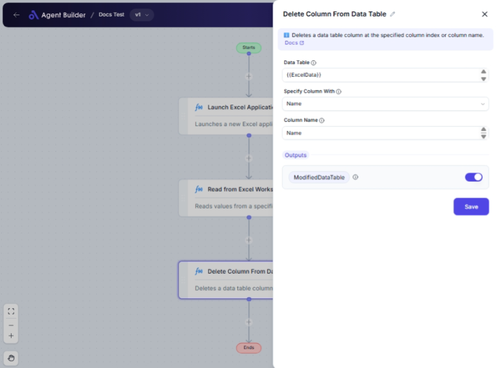

import { Callout, Steps } from "nextra/components";

# Delete Column From Data Table

The **Delete Column From Data Table** node enables you to remove a specific column from a data table. This action is useful when you need to eliminate unnecessary or confidential columns before processing, sharing, or visualizing the data.

For example:

- Cleaning up data by removing unused columns.
- Deleting sensitive columns containing private information.
- Simplifying data tables for easier analysis.

## Configuration Options

| Field Name              | Description                                                                                                   | Input Type | Required? | Default Value |
| ----------------------- | ------------------------------------------------------------------------------------------------------------- | ---------- | --------- | ------------- |
| **Data Table**          | The data table to modify.                                                                                     | Text       | No        | _(empty)_     |
| **Specify Column With** | Specifies whether to delete the column by its name or by its position index.                                  | Select     | No        | Name          |
| **Column Name**         | The name of the column you wish to delete. _This field is required if you are selecting column by name._      | Text       | No        | _(empty)_     |
| **Column Index**        | The position number of the column you wish to delete. _This field is required if you are selecting by index._ | Text       | No        | _(empty)_     |

## Expected Output Format

The output is a **modified data table** with the specified column removed. The rest of the table remains unchanged.

## Step-by-Step Guide

<Steps>

### Step 1

Add the **Delete Column From Data Table** node into your flow.

### Step 2

Enter your data table into the **Data Table** field.

### Step 3

In the **Specify Column With** dropdown, choose how you want to identify the column to delete:

- **Name**: By its name.
- **Index**: By its position number.

### Step 4

If you selected **Name**:

- Fill in the **Column Name** field with the exact name of the column to delete.

### Step 5

If you selected **Index**:

- Fill in the **Column Index** field with the zero-based index of the column to delete (e.g., use `0` for the first column).

### Step 6

The data table, minus the specified column, is now ready for further use.

</Steps>

<Callout type="info" title="Tip">
  To delete multiple columns, add multiple **Delete Column From Data Table**
  nodes, each targeting a different column.
</Callout>

<Callout type="warning" title="Warning">
  Ensure correct column names or indexes are specified; deleting the wrong
  column might lose valuable data.
</Callout>

## Input/Output Examples

| Specify Column With | Data Table                         | Column Name | Column Index | Modified Data Table       |
| ------------------- | ---------------------------------- | ----------- | ------------ | ------------------------- |
| Name                | `[{A:1,B:2,C:3},{A:4,B:5,C:6}]`    | B           | _(n/a)_      | `[{A:1,C:3},{A:4,C:6}]`   |
| Index               | `[{X:7,Y:8,Z:9},{X:10,Y:11,Z:12}]` | _(n/a)_     | 2            | `[{X:7,Y:8},{X:10,Y:11}]` |

## Common Mistakes & Troubleshooting

| Problem                 | Solution                                                                                                                                   |
| ----------------------- | ------------------------------------------------------------------------------------------------------------------------------------------ |
| **Column not deleted**  | Ensure the correct **Column Name** or **Column Index** is specified. Check that your data table matches the headers and indexes specified. |
| **Typing errors**       | Double-check for spelling errors in **Column Name**.                                                                                       |
| **Using 1-based index** | Remember that **Column Index** is zero-based; the count starts from 0, not 1.                                                              |

## Real-World Use Cases

- **Data Anonymization**: Remove personal identifiers (e.g., `Name`) from customer data.
- **Report Simplification**: Delete wide data reports for conciseness by removing unwanted columns.
- **Preprocessing**: Exclude unnecessary data fields before machine learning model training or exporting.
