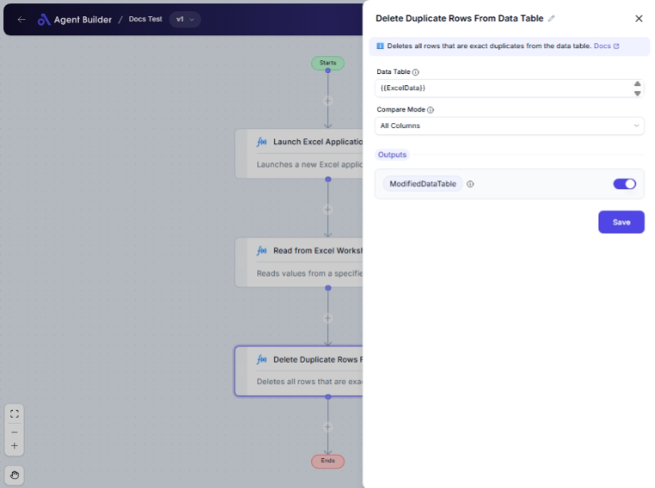

import { Callout, Steps } from "nextra/components";

# Delete Duplicate Rows From Data Table

The **Delete Duplicate Rows From Data Table** node allows you to efficiently identify and remove any duplicate rows within a data table. It is particularly useful in scenarios where data consistency and uniqueness are crucial, such as preparing datasets for analysis or reporting.

For example:

- Cleaning up survey data to ensure each respondent is counted once.
- Preparing a customer list by removing duplicate entries.
- Simplifying product databases by ensuring unique items.

  

## Configuration Options

| Field Name                  | Description                                                                                     | Input Type | Required? | Default Value |
| --------------------------- | ----------------------------------------------------------------------------------------------- | ---------- | --------- | ------------- |
| **Data Table**              | The data table you want to process and clean, removing any duplicate rows.                      | Text       | Yes       | _(empty)_     |
| **Compare Mode**            | Choose whether to compare all columns or only selected ones to find duplicates.                 | Select     | No        | AllColumns    |
| **Column Names To Compare** | List the column names to check for duplicates when "Compare Mode" is set to "Selected Columns". | Text       | No        | _(empty)_     |

## Expected Output Format

The output of this node is a **cleaned data table**, free of any duplicate rows.

- If "All Columns" is selected, the data table is compared across all columns.
- If "Selected Columns" is chosen, only the specified columns are compared for duplicates.

## Step-by-Step Guide

<Steps>
### Step 1

Add the **Delete Duplicate Rows From Data Table** node into your flow.

### Step 2

In the **Data Table** field, input the data table you want to process.

### Step 3

Select the **Compare Mode** from the dropdown to determine duplication comparison criteria:

- **All Columns**: Compares all columns in every row.
- **Selected Columns**: Compares only specific columns noted by you.

### Step 4

If you opt for **Selected Columns**, an additional **Column Names To Compare** field appears. Enter the column names you wish to use to identify duplicates, separated by commas.

### Step 5

The processed data table without duplicates will be available as **CleanedDataTable** for use in other nodes or further operations.

</Steps>

<Callout type="info" title="Tip">
  To ensure that the "Column Names To Compare" field appears, select "Selected
  Columns" in the **Compare Mode** dropdown.
</Callout>

## Input/Output Examples

| Compare Mode     | Input Data Table | Column Names To Compare | Output Data Table                   |
| ---------------- | ---------------- | ----------------------- | ----------------------------------- |
| All Columns      | Full Survey Data | _(n/a)_                 | Unique Respondent Entries           |
| Selected Columns | Customer List    | Email, Phone            | Unique Customers by Email and Phone |

## Common Mistakes & Troubleshooting

| Problem                                            | Solution                                                                                                        |
| -------------------------------------------------- | --------------------------------------------------------------------------------------------------------------- |
| **"Column Names To Compare" field is not visible** | Ensure you have selected **"Selected Columns"** in Compare Mode; this makes the field visible.                  |
| **Data Table input is empty or incorrect format**  | Verify and ensure that the input provided is a valid data table format.                                         |
| **Duplicates not being removed as expected**       | Double-check your Compare Mode and refresh the table data; ensure selected columns for comparison are relevant. |

## Real-World Use Cases

- **Event Management**: Consolidate guest lists by removing duplicate names to avoid over-booking.
- **Data Analysis**: Prepare datasets by ensuring each row represents unique data points for accurate analysis.
- **Inventory Management**: Clean product lists to maintain unique stock items and accurate inventory records.
