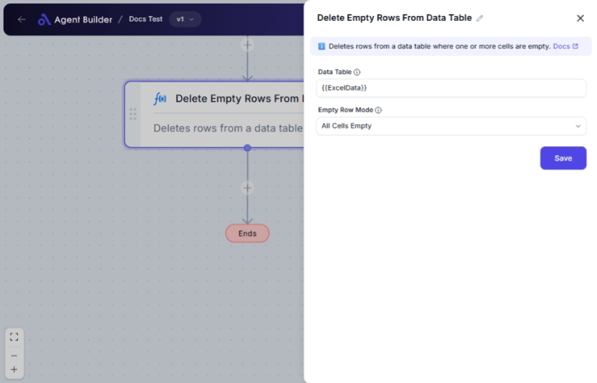

import { Callout, Steps } from "nextra/components";

# Delete Empty Rows From Data Table

The **Delete Empty Rows From Data Table** node helps you clean up your data by removing unnecessary empty rows. This is particularly useful when you're working with large datasets and want to ensure that only meaningful data is processed or analyzed.

For instance:

- Streamlining a dataset by excluding rows without any data.
- Preparing data for analysis or reporting by ensuring all rows contain useful information.

## Configuration Options

| Field Name                | Description                                                                                                           | Input Type | Required? | Default Value |
| ------------------------- | --------------------------------------------------------------------------------------------------------------------- | ---------- | --------- | ------------- |
| **Data Table**            | The data table containing the rows to process.                                                                        | Text       | Yes       | _(empty)_     |
| **Empty Row Mode**        | Specifies how to detect empty rows. Choose from: "All Cells Empty", "Any Cell Empty", or "Based on Specific Columns". | Select     | Yes       | AllEmpty      |
| **Column Names To Check** | List of column names to check for emptiness. Only required if "Empty Row Mode" is set to "Based on Specific Columns". | Text       | No        | _(empty)_     |

## Expected Output Format

The output of this node is a **cleaned data table** with all undesired empty rows removed, ready for further processing or analysis.

- If "All Cells Empty" is selected, rows where all specified cells are empty will be removed.
- If "Any Cell Empty" is selected, rows where any specified cell is empty will be removed.
- If "Based on Specific Columns" is selected, rows with empty specified columns will be removed.

## Step-by-Step Guide

<Steps>
### Step 1

Add **Delete Empty Rows From Data Table** node into your flow.

### Step 2

In the **Data Table** field, enter the data table you wish to clean.

### Step 3

Choose the **Empty Row Mode** from the dropdown to define how empty rows are identified:

- **All Cells Empty**: Will remove rows where all the specified cells are empty.
- **Any Cell Empty**: Will remove rows if any cell in specified columns is empty.
- **Based on Specific Columns**: Specify exact columns to check for empty cells.

### Step 4

(Optional) If **Based on Specific Columns** is selected, enter the column names to check in the **Column Names To Check** field, separated by commas.

### Step 5

The cleaned data table is now ready for additional processing or integration into your workflow.

</Steps>

<Callout type="info" title="Note">
  If you do not select "Based on Specific Columns" in the **Empty Row Mode**
  dropdown, the "Column Names To Check" field will not appear.
</Callout>

## Input/Output Examples

| Empty Row Mode            | Data Table Example                                | Column Names To Check | Output Data Table Example          |
| ------------------------- | ------------------------------------------------- | --------------------- | ---------------------------------- |
| All Cells Empty           | \[[], [1, 2], []\]                                | _(n/a)_               | \[[1, 2]\]                         |
| Any Cell Empty            | \[["a", "b"], ["c", ""], ["e", "f"]\]             | _(n/a)_               | \[["a", "b"], ["e", "f"]\]         |
| Based on Specific Columns | \[["a", "", "c"], ["", "b", ""], ["e", "", "f"]\] | 1, 2                  | \[["a", "", "c"], ["e", "", "f"]\] |

## Common Mistakes & Troubleshooting

| Problem                                 | Solution                                                                                                               |
| --------------------------------------- | ---------------------------------------------------------------------------------------------------------------------- |
| **Column Names To Check not appearing** | Ensure **"Based on Specific Columns"** is selected in the Empty Row Mode dropdown for the field to appear.             |
| **Data Table is not provided**          | Make sure to input a data table in the **Data Table** field, as this is required for the node to function.             |
| **Output is not as expected**           | Verify the **Empty Row Mode** setting and if needed, ensure correct column names are specified for checking emptiness. |

## Real-World Use Cases

- **Data Preparation**: Clean survey or form data by removing incomplete submissions.
- **Inventory Management**: Ensure that all products listed have necessary details by removing rows with missing information.
- **Financial Data Processing**: Prepare transaction logs by removing empty entries before running analyses.
