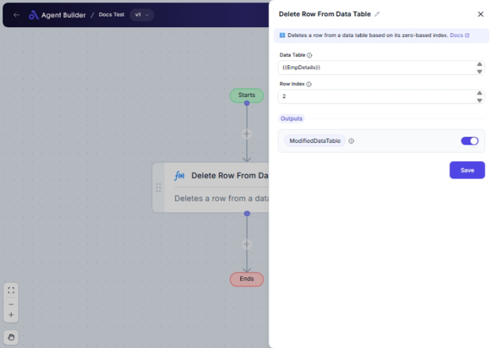

import { Callout, Steps } from "nextra/components";

# Delete Row From Data Table

The **Delete Row From Data Table** node enables you to remove a specific row from a data table by specifying its index. This is particularly useful for cleaning up datasets by eliminating unnecessary or unwanted rows, ensuring your data is ready for analysis or reporting.

For example, you might use this node to:

- Remove erroneous entries in a dataset.
- Simplify data by deleting unwanted rows, such as blank or irrelevant records.

{/*  */}

## Configuration Options

| Field Name     | Description                                        | Input Type | Required? | Default Value |
| -------------- | -------------------------------------------------- | ---------- | --------- | ------------- |
| **Data Table** | The data table from which the row will be deleted. | Text       | Yes       | _(empty)_     |
| **Row Index**  | The zero-based index of the row to delete.         | Text       | Yes       | _(empty)_     |

## Expected Output Format

The output of this node is an updated version of the input data table that no longer contains the specified row. The output is designated as **ModifiedDataTable**, which retains all original columns and remaining rows.

## Step-by-Step Guide

<Steps>
### Step 1

Add the **Delete Row From Data Table** node into your flow.

### Step 2

In the **Data Table** field, enter the data table that contains the row you wish to delete.

### Step 3

In the **Row Index** field, specify the index of the row to be deleted. Remember that this index is zero-based, so the first row in the table is index `0`.

### Step 4

Once configured, the node will process the data and produce a **ModifiedDataTable** output that excludes the specified row.

</Steps>

<Callout type="warning" title="Important">
  The **Row Index** must be valid and within the range of the data table's rows,
  starting at zero. Entering an incorrect index may cause an error or unexpected
  behavior.
</Callout>

## Input/Output Examples

| Data Table               | Row Index | Output Value  | Output Type                 |
| ------------------------ | --------- | ------------- | --------------------------- |
| `[[A, B, C], [D, E, F]]` | 1         | `[[A, B, C]]` | Modified Data Table (Array) |

## Common Mistakes & Troubleshooting

| Problem                                    | Solution                                                                                                                           |
| ------------------------------------------ | ---------------------------------------------------------------------------------------------------------------------------------- |
| **Invalid Row Index**                      | Ensure the Row Index is within the valid range of the data table. For example, if there are 3 rows, valid indices are 0, 1, and 2. |
| **Empty DataTable Input**                  | Verify that the Data Table field is correctly populated. Do not leave it empty.                                                    |
| **Row Index Entered as Non-Numeric Value** | The Row Index must be a numeric value. Avoid typing text or special characters.                                                    |

## Real-World Use Cases

- **Data Cleansing**: Remove duplicate or erroneous rows from customer data lists to prepare for a mailing campaign.
- **Inventory Management**: Delete rows corresponding to discontinued products from inventory databases.
- **Report Generation**: Exclude unwanted records from datasets before generating monthly performance reports.
