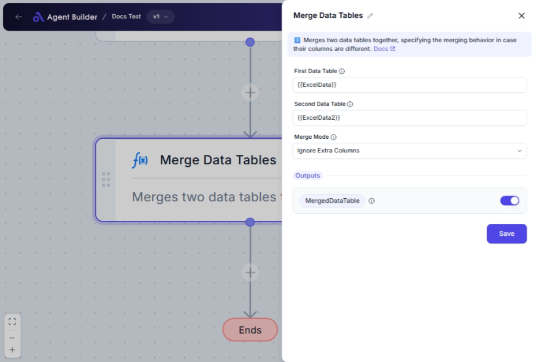

import { Callout, Steps } from "nextra/components";

# Merge Data Tables

The **Merge Data Tables** node allows you to combine two data tables into a single cohesive table. This is particularly useful when you want to enrich data by adding more information from another data source, or when you need to compile data from different tables for unified reporting or analysis.

For example:

- Combining sales data from different regions to gain an overall view.
- Merging customer information from separate databases.

{/*  */}

## Configuration Options

| Field Name            | Description                                                                              | Input Type | Required? | Default Value   |
| --------------------- | ---------------------------------------------------------------------------------------- | ---------- | --------- | --------------- |
| **First Data Table**  | The primary data table you want to merge.                                                | Text       | Yes       | _(empty)_       |
| **Second Data Table** | The secondary data table that will be merged with the first.                             | Text       | Yes       | _(empty)_       |
| **Merge Mode**        | How to manage extra columns from the second data table that aren't present in the first. | Select     | Yes       | AddExtraColumns |

## Expected Output Format

The output of this node is a **merged data table**, which is a cohesive combination of two input tables based on the selected merge mode options.

- The output table will reflect all or selected columns from both tables depending on the chosen merge mode.

## Step-by-Step Guide

<Steps>
### Step 1

Add **Merge Data Tables** node into your flow.

### Step 2

In the **First Data Table** field, enter the data for the primary table you want to merge.

### Step 3

In the **Second Data Table** field, provide the data for the secondary table to be merged with the first.

### Step 4

In the **Merge Mode** dropdown, choose how you want to handle columns that are present only in the second table:

- **Add Extra Columns**: Include additional columns from the second table.
- **Ignore Extra Columns**: Do not include additional columns from the second table.
- **Error On Extra Columns**: Produces an error if extra columns are found.

### Step 5

The merged data will be produced as **MergedDataTable** for use in subsequent nodes.

</Steps>

<Callout type="info" title="Note">
  To avoid unexpected errors, confirm that the column names in your tables are
  correctly aligned and appropriately formatted.
</Callout>

## Input/Output Examples

| Action                 | First Table | Second Table | Merge Mode          | Merged Table | Output Type |
| ---------------------- | ----------- | ------------ | ------------------- | ------------ | ----------- |
| Add Extra Columns      | Table A     | Table B      | AddExtraColumns     | Combined AB  | DataTable   |
| Ignore Extra Columns   | Table A     | Table B      | IgnoreExtraColumns  | Table A+B    | DataTable   |
| Error On Extra Columns | Table A     | Table B      | ErrorOnExtraColumns | Error        | Message     |

## Common Mistakes & Troubleshooting

| Problem                           | Solution                                                                                                                             |
| --------------------------------- | ------------------------------------------------------------------------------------------------------------------------------------ |
| **Mismatch in column headings**   | Ensure that both tables have the same column headings if you are using merge modes that do not allow extra columns.                  |
| **Unexpected error during merge** | Double-check the data format and the merge mode settings, especially if using "Error On Extra Columns".                              |
| **Merged table not as expected**  | Verify that the data in both input tables is correctly input and consider how merge modes affect the presence of additional columns. |

## Real-World Use Cases

- **Business Analytics**: Combine quarterly reports from different departments into a single fiscal report.
- **Data Consolidation**: Merge demographic data with sales data for better customer insights.
- **Customer Relationship Management (CRM)**: Integrate customer activity logs from multiple platforms to a unified view.
