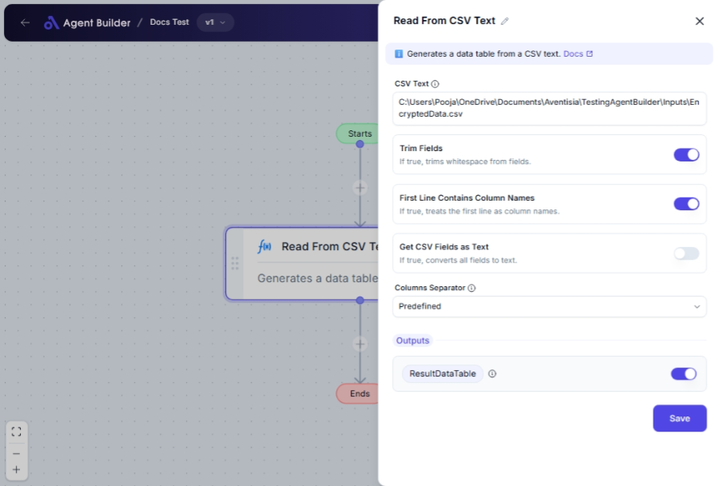

import { Callout, Steps } from "nextra/components";

# Read From CSV Text

The **Read From CSV Text** node enables you to transform plain CSV data contained in text form into a structured data table. This is particularly helpful when you need to extract, analyze, or display CSV data without manually handling each row and column.

For example, you might want to:

- Convert data from a spreadsheet exported as CSV for processing within your automation.
- Parse CSV data received from an API or web service.
- Prepare data for reports by organizing it into a structured table.

{/*  */}

## Configuration Options

| Field Name                           | Description                                                                                            | Input Type | Required? | Default Value |
| ------------------------------------ | ------------------------------------------------------------------------------------------------------ | ---------- | --------- | ------------- |
| **CSV Text**                         | The text containing CSV data to be parsed.                                                             | Text       | Yes       | _(empty)_     |
| **Trim Fields**                      | Option to remove surrounding spaces in each field.                                                     | Switch     | No        | _(empty)_     |
| **First Line Contains Column Names** | Determines if the first row should be treated as column headers.                                       | Switch     | No        | _(empty)_     |
| **Get CSV Fields as Text**           | Converts all fields in the CSV to text format, even if they are numeric.                               | Switch     | No        | _(empty)_     |
| **Columns Separator**                | Defines how columns are separated in the CSV text. Choices include system commas or custom separators. | Select     | No        | Predefined    |
| **Custom Separator**                 | The specific character to separate columns, utilized when **Columns Separator** is set to "Custom".    | Text       | No        | _(empty)_     |
| **Fixed Column Widths**              | Specifies width for each column, applicable when **Columns Separator** is "Fixed Column Widths".       | Text       | No        | _(empty)_     |

## Expected Output Format

The output of this node is a **structured data table**. The table can be used in subsequent nodes for processing and will be named **ResultDataTable**.

- The first row is treated as headers if "First Line Contains Column Names" is enabled.
- Subsequent rows convert into table rows with cells matching the header or column indices.

## Step-by-Step Guide

<Steps>
### Step 1

Add **Read From CSV Text** node to your flow process.

### Step 2

In the **CSV Text** field, paste or type the CSV formatted data that you wish to convert.

### Step 3

Decide if your data needs trimming; toggle **Trim Fields** to trim unwanted spaces from each field.

### Step 4

If your CSV's first line contains headers, turn on **First Line Contains Column Names** to organize your columns appropriately.

### Step 5

Select how columns are separated under **Columns Separator**. Use "Predefined" for commas or "Custom" for another specific separator.

### Step 6

If **Columns Separator** is set to "Custom", provide the character in **Custom Separator** field.

### Step 7

If dealing with fixed-width columns, switch the **Columns Separator** to "Fixed Column Widths" and input the widths in **Fixed Column Widths**.

### Step 8

After configuration, the resulting table will be available as **ResultDataTable**, ready for further utilization.

</Steps>

<Callout type="info" title="Note">
  If you select "Custom" in the **Columns Separator** option, ensure to specify
  a valid character in the **Custom Separator** field to avoid parsing errors.
</Callout>

## Input/Output Examples

| Input CSV Text                             | Trim Fields | First Line Contains Column Names | Custom Separator | Resulting Table                                                         |
| ------------------------------------------ | ----------- | -------------------------------- | ---------------- | ----------------------------------------------------------------------- |
| `Name, Age, Location\nAlice, 30, New York` | Yes         | Yes                              | _(empty)_        | Table with columns "Name", "Age", "Location" and corresponding row data |
| `a;b;c\n1;b;b\nc;c;c`                      | No          | No                               | `;`              | Columns separated by semicolons with data in rows as defined            |

## Common Mistakes & Troubleshooting

| Problem                                      | Solution                                                                                                                                               |
| -------------------------------------------- | ------------------------------------------------------------------------------------------------------------------------------------------------------ |
| **Fields are not separating correctly**      | Ensure you've selected the right **Columns Separator**. If using a custom separator, confirm the correct character is entered in **Custom Separator**. |
| **First line data is misplaced**             | If headers are not intended, uncheck **First Line Contains Column Names** so they are parsed as data rows.                                             |
| **Whitespace affecting field processing**    | Use the **Trim Fields** option to remove unnecessary spaces around your CSV data fields.                                                               |
| **Fixed Column Widths not parsing properly** | Double-check your column widths in **Fixed Column Widths** matches your CSV formatting.                                                                |

## Real-World Use Cases

- **Importing Inventory Data**: Convert exported CSV from inventory systems into tables for stock management.
- **Customer Feedback Analysis**: Parse CSV from surveys to generate structured data for reports.
- **Sales Data Review**: Read incoming CSV sales records and prepare them for analysis in financial sheets.
