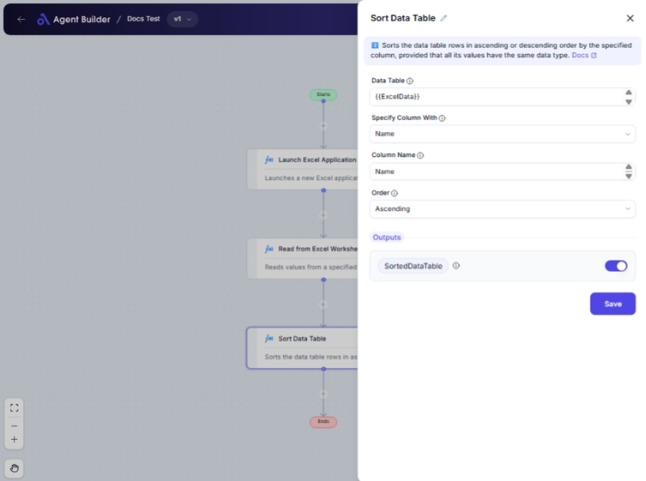

import { Callout, Steps } from "nextra/components";

# Sort Data Table

The **Sort Data Table** node allows you to organize your data efficiently by sorting the entries within a table. You can choose how to identify the column (by name or index) and determine the sort order (ascending or descending). This feature is useful when you need to present data in a specific order or perform further analysis on sorted data.

For example:

- Sorting employee records by last name.
- Ordering sales data by the amount in descending order.
- Arranging product lists alphabetically or by product ID.

  

## Configuration Options

| Field Name              | Description                                                   | Input Type | Required? | Default Value |
| ----------------------- | ------------------------------------------------------------- | ---------- | --------- | ------------- |
| **Data Table**          | The DataTable containing the data to be sorted.               | Text       | Yes       | _(empty)_     |
| **Specify Column With** | Choose whether to specify the column by name or index.        | Select     | Yes       | Name          |
| **Column Name**         | The name of the column to sort by (when specified by name).   | Text       | No        | _(empty)_     |
| **Column Index**        | The index of the column to sort by (when specified by index). | Text       | No        | _(empty)_     |
| **Order**               | Specifies whether to sort in ascending or descending order.   | Select     | Yes       | Ascending     |

## Expected Output Format

The output of this node is a **Sorted Data Table**, structured the same way as the input data table but reordered based on your specified sorting criteria.

## Step-by-Step Guide

<Steps>
### Step 1

Add the **Sort Data Table** node into your flow.

### Step 2

In the **Data Table** field, enter the data table that you wish to sort.

### Step 3

Select **Specify Column With** to determine how you will specify the column (either **Name** or **Index**).

### Step 4

If you selected **Name**:

- In the **Column Name** field, enter the name of the column by which to sort.

If you selected **Index**:

- In the **Column Index** field, enter the index number of the column.

### Step 5

Choose the **Order** to sort the data:

- **Ascending** will sort the data from lowest to highest.
- **Descending** will sort the data from highest to lowest.

### Step 6

The processed data will be available as **SortedDataTable** for further use in your workflow.

</Steps>

<Callout type="info" title="Note">
  Ensure that the column specified, whether by name or index, exists in the data
  table to avoid errors.
</Callout>

## Input/Output Examples

| Specify Column With | Column Name | Column Index | Order      | Output Table                    |
| ------------------- | ----------- | ------------ | ---------- | ------------------------------- |
| Name                | Age         | _(n/a)_      | Ascending  | Sorted by ascending Age         |
| Index               | _(n/a)_     | 2            | Descending | Sorted by descending 3rd column |

## Common Mistakes & Troubleshooting

| Problem                         | Solution                                                                                                                    |
| ------------------------------- | --------------------------------------------------------------------------------------------------------------------------- |
| **Column not found**            | Ensure the column name or index is correct and exists in the data table.                                                    |
| **Incorrect sort order**        | Check if the desired order (ascending/descending) was correctly selected.                                                   |
| **Data does not appear sorted** | Confirm that the correct column was specified by either its name or index according to the **Specify Column With** setting. |

## Real-World Use Cases

- **Organizing Reports**: Quickly sort large datasets by relevant criteria for easy analysis.
- **Alphabetizing Lists**: Maintain systematically arranged contacts or item lists.
- **Structured Data Analysis**: Prepare data for visualization tools by organizing raw data efficiently.
