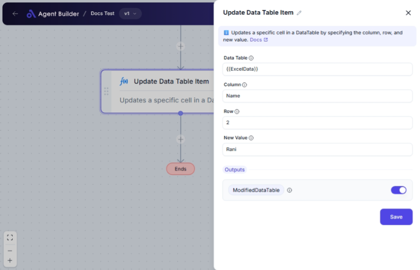

import { Callout, Steps } from "nextra/components";

# Update Data Table Item

The **Update Data Table Item** node allows you to modify specific entries within a data table by changing the values in predefined cells. This is useful when you need to dynamically alter information in your datasets, such as updating a record after a data entry error or adjusting values in real-time processes.

For example:

- Correcting data errors by updating an incorrect entry in your dataset.
- Automatically changing values in response to other workflow triggers.
- Customizing data tables by modifying the values of specific cells.

 

## Configuration Options

| Field Name     | Description                                              | Input Type | Required? | Default Value |
| -------------- | -------------------------------------------------------- | ---------- | --------- | ------------- |
| **Data Table** | The DataTable containing the data to be updated.         | Text       | Yes       | _(empty)_     |
| **Column**     | The name of the column where the update should occur.    | Text       | Yes       | _(empty)_     |
| **Row**        | The row index or primary key value of the row to update. | Text       | Yes       | _(empty)_     |
| **New Value**  | The new value to set for the specified cell.             | Text       | Yes       | _(empty)_     |

## Expected Output Format

The output of this node is the **Modified Data Table**, which is the updated version of the original data table with the specified cell(s) changed.

- Output will be in the form of a data table with the type `Modified Data Table`.

## Step-by-Step Guide

<Steps>
### Step 1

Add **Update Data Table Item** node into your flow.

### Step 2

In the **Data Table** field, input the data table that contains the data you want to modify.

### Step 3

Specify the **Column** of the data table where the cell update should occur.

### Step 4

Enter the **Row** identifier, which can be a row index or a primary key value, to locate the specific cell to update.

### Step 5

Input the **New Value** that you want to assign to the specified cell.

### Step 6

The modified data table will be available as **ModifiedDataTable** for use in other nodes.

</Steps>

<Callout type="info" title="Tip">
  Ensure that the row and column identifiers are correct to avoid unintentional
  data modifications.
</Callout>

## Input/Output Examples

| Data Table      | Column   | Row  | New Value | Output Data Table |
| --------------- | -------- | ---- | --------- | ----------------- |
| SampleTable     | Age      | 1    | 30        | ModifiedDataTable |
| EmployeeRecords | LastName | 1025 | "Smith"   | ModifiedDataTable |

## Common Mistakes & Troubleshooting

| Problem                           | Solution                                                                                                   |
| --------------------------------- | ---------------------------------------------------------------------------------------------------------- |
| **Wrong cell updated**            | Verify that the **Row** and **Column** values are accurately specified to target the right cell.           |
| **Column not found**              | Ensure that the column name matches the column headers exactly, including spaces and cases.                |
| **No changes seen in the output** | Confirm that any required fields are correctly filled out, especially when errors occur during submission. |

## Real-World Use Cases

- **Inventory Management**: Automatically update stock levels in response to sales transactions.
- **Customer Databases**: Correct user information where typos have occurred or data updates are necessary.
- **Financial Records**: Adjust financial records or ledger entries based on new transaction data.
