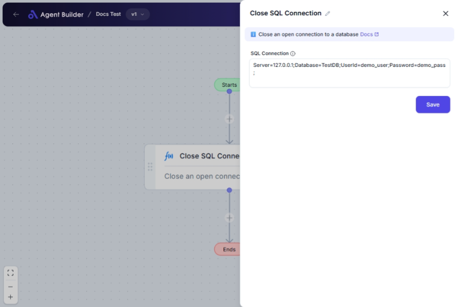

import { Callout, Steps } from "nextra/components";

# Close SQL Connection

The **Close SQL Connection** node is an essential part of managing database operations. This node ensures that a connection to your SQL database is properly closed once you have completed your required operations. Properly closing SQL connections avoids unnecessary resource consumption and potential database locking issues. Use this node whenever you finish a set of database operations to maintain optimal performance and resource use.

## Configuration Options

| Field Name         | Description                           | Input Type | Required? | Default Value |
| ------------------ | ------------------------------------- | ---------- | --------- | ------------- |
| **SQL Connection** | The SQL connection you wish to close. | Text       | Yes       | _(empty)_     |

## Expected Output Format

The node does not produce a direct output in terms of modified data; it simply acts to close an existing SQL connection. The effective result is the release of resources tied to the SQL connection.

## Step-by-Step Guide

<Steps>
### Step 1

Add the **Close SQL Connection** node into your flow.

### Step 2

In the **SQL Connection** field, enter the identifier for the SQL connection you want to close. This identifier should match the connection opened by prior workflow nodes.

### Step 3

Once configured, the node will ensure the designated SQL connection is properly closed, preventing any potential resource leaks.

</Steps>

<Callout type="warning" title="Important">
  Always use the **Close SQL Connection** node after operations that require
  database access to ensure that all resources are properly released.
</Callout>

## Common Mistakes & Troubleshooting

| Problem                          | Solution                                                                                                                                 |
| -------------------------------- | ---------------------------------------------------------------------------------------------------------------------------------------- |
| **SQL Connection not closing**   | Ensure that the identifier provided matches a currently open connection. Check if the connection was opened correctly in previous nodes. |
| **Resource availability issues** | If you encounter problems with available resources, confirm that all SQL connections are closed post-operation using this node.          |

## Real-World Use Cases

- **Database Maintenance Scripts**: After executing a set of maintenance commands, use this node to ensure all connections are closed to prevent unintentional locks.
- **Data Processing Workflows**: In ETL operations, once data has been extracted and loaded, this node ensures database connections are not left open, which could degrade performance.
- **Application Resource Management**: Helps in managing application resource usage by ensuring all SQL connections are explicitly closed after use, leading to better application performance.
