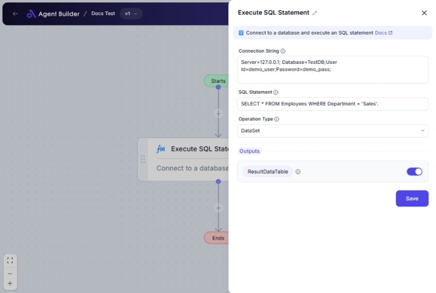

import { Callout, Steps } from "nextra/components";

# Execute SQL Statement

The **Execute SQL Statement** node allows you to connect to a database and run SQL queries, such as insert, update, delete, or retrieval statements. This is helpful for automating database operations or retrieving data for use in reports or further processing.

For example:

- Running a query to update product prices in a database.
- Retrieving list of customers as part of a report generation process.
- Deleting records from a table based on certain conditions.

{/*  */}

## Configuration Options

| Field Name            | Description                            | Input Type | Required? | Default Value |
| --------------------- | -------------------------------------- | ---------- | --------- | ------------- |
| **Connection String** | The connection string to the database. | Text       | Yes       | _(empty)_     |
| **SQL Statement**     | The SQL statement to execute.          | Text       | Yes       | _(empty)_     |
| **Operation Type**    | The type of SQL operation to perform.  | Select     | No        | _(empty)_     |

## Expected Output Format

The output produced by this node can be a **data table** with the execution results, depending on the operation type you choose.

- For **Non-Query** operations: No output data is returned.
- For **Scalar** operations: The output will be a single value (e.g., sum or count).
- For **DataSet** operations: A complete table of data based on your query.

## Step-by-Step Guide

<Steps>
### Step 1

Add **Execute SQL Statement** node into your flow.

### Step 2

Fill in the **Connection String** field with the database information required to establish the connection.

### Step 3

Enter the SQL query you need in the **SQL Statement** field. Make sure the syntax is correct for your database type.

### Step 4

Optional: Choose the **Operation Type** from the dropdown based on your SQL command:

- **Non-Query**: To execute statements like insert, update, or delete.
- **Scalar**: To execute a query that returns a single value.
- **DataSet**: To retrieve multiple rows of data.

### Step 5

After running the node, check the **Result Data Table** for the output data available for use in subsequent nodes.

</Steps>

<Callout type="info" title="Tip">
  Use the **Scalar** operation if your SQL query is meant to return a single
  data point or aggregate result.
</Callout>

## Input/Output Examples

| Operation Type | Input SQL Statement                           | Output Value           | Output Type      |
| -------------- | --------------------------------------------- | ---------------------- | ---------------- |
| Non-Query      | `INSERT INTO products (name) VALUES ('Item')` | None                   | None             |
| Scalar         | `SELECT COUNT(*) FROM customers`              | 150                    | Number (Integer) |
| DataSet        | `SELECT * FROM orders`                        | Table of order records | Data Table       |

## Common Mistakes & Troubleshooting

| Problem                             | Solution                                                                                                                               |
| ----------------------------------- | -------------------------------------------------------------------------------------------------------------------------------------- |
| **Connection String Incorrect**     | Ensure you've entered a valid connection string with the correct database credentials and server information.                          |
| **SQL Syntax Error**                | Verify your SQL statement syntax, particularly spelling of table and column names, as well as proper quotation and parenthesis use.    |
| **Incorrect Operation Type Choice** | Choose the appropriate operation type for your SQL query; selecting the wrong type may lead to unexpected results or no returned data. |

## Real-World Use Cases

- **Customer Data Extraction**: Run SQL statements to extract customer data for personalized marketing campaigns.
- **Inventory Updates**: Automate updates to stock levels from new shipment data.
- **Sales Reporting**: Collect sales data and generate summary reports for analysis.
