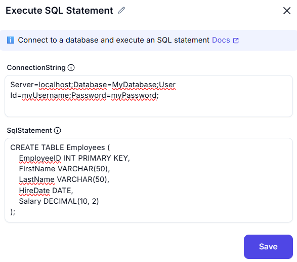

# Execute SQL Statement

## **Description**

This screenshot demonstrates an interface for executing an SQL statement. Users can establish a database connection using a connection string and execute SQL queries.



---

## **Input Fields**

### **1. ConnectionString**
- A text input field containing the SQL connection string.
Example format:
  ```plaintext
  Server=myServerAddress;Database=myDataBase;User Id=myUsername;Password=myPassword;
  ```
- This string includes necessary credentials to access the database.

### **2. SqlStatment**
- The SQL statement to execute.
Example format:
  ```plaintext
  CREATE TABLE Employees (
    EmployeeID INT PRIMARY KEY,
    FirstName VARCHAR(50),
    LastName VARCHAR(50),
    HireDate DATE,
    Salary DECIMAL(10, 2));

  ```
---
### **Summary**

This tool is designed to execute SQL queries by either:

Establishing a new connection using a connection string.
Utilizing an existing SQL connection.
It includes advanced options for additional configurations and error-handling mechanisms to manage execution failures efficiently.