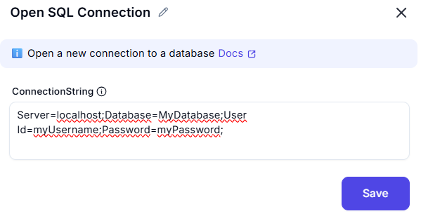

# Open SQL Connection

## Description
This screenshot demonstrates a tool or interface designed to establish an SQL connection. The interface allows users to input a connection string to connect to a database.



---
## **Input**
**Connection String**:

```plaintext
  Server=myServerAddress;Database=myDataBase;User Id=myUsername;Password=myPassword;
```
## **Summary**
This tool is useful for connecting to SQL databases by providing a connection string. It simplifies the process of establishing database connections for automation, data retrieval, and management.