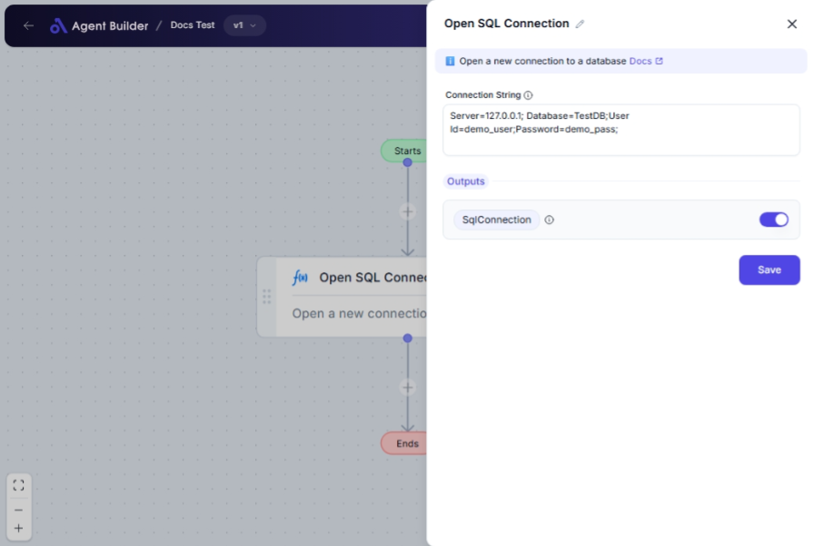

import { Callout, Steps } from "nextra/components";

# Open SQL Connection

The **Open SQL Connection** node is used to establish a connection to a SQL database. This action is crucial for performing various database operations, such as querying, updating, or managing data. You would typically use this node as the first step in your database workflow, allowing subsequent nodes to utilize the active connection for their tasks.

## Configuration Options

| Field Name            | Description                                                                                                                                  | Input Type | Required? | Default Value |
| --------------------- | -------------------------------------------------------------------------------------------------------------------------------------------- | ---------- | --------- | ------------- |
| **Connection String** | The string needed to connect to the database. It contains information like the database's location, the database name, and your credentials. | Text       | Yes       | _(empty)_     |

## Expected Output Format

The result from this node is an **open SQL connection** that other nodes can use to interact with the database.

- Output: A reference to the SQL connection available as **SqlConnection**.

## Step-by-Step Guide

<Steps>
### Step 1

Add the **Open SQL Connection** node into your flow.

### Step 2

In the **Connection String** field, enter the connection string for your database. This string should include details like the server name, database name, user ID, and password.

### Step 3

The established connection will be represented as **SqlConnection**, which can be used in subsequent nodes to perform operations on the database.

</Steps>

<Callout type="info" title="Tip">
  Make sure your connection string is accurate. Errors in the connection string
  can prevent the node from accessing the database.
</Callout>

## Input/Output Examples

| Connection String                                                                    | Output Value  | Output Type    |
| ------------------------------------------------------------------------------------ | ------------- | -------------- |
| `Server=myServerAddress;Database=myDataBase;User Id=myUsername;Password=myPassword;` | SqlConnection | SQL Connection |

## Common Mistakes & Troubleshooting

| Problem                              | Solution                                                                                                    |
| ------------------------------------ | ----------------------------------------------------------------------------------------------------------- |
| **Invalid Connection String Format** | Verify the structure of your connection string with necessary components (server, database, login details). |
| **Connection Fails**                 | Check your internet connection and the database server status to ensure accessibility.                      |
| **Incorrect Credentials**            | Double-check the user ID and password in your connection string.                                            |

## Real-World Use Cases

- **Data Analytics**: Establish connections to data warehouses for data analysis and reporting.
- **Application Integration**: Connect to a SQL database as part of a larger business application workflow.
- **Data Migration**: Set up a connection for transferring data between databases.
- **Real-time Data Access**: Use live data from the SQL database in your automated workflows.
