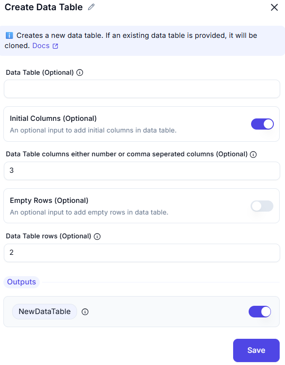

# Create Data Table

## Description
Interface for configuring a new data table with pre-defined dimensions.

## Input
- **Data Table**
    - An optional input data table to clone or use as a template.

- **Initial Columns**
    - An optional input to add initial columns in data table.

- **Data Table columns either number or comma seperated columns**
    - Enter number of columns required

- **Empty Rows**
    - An optional input to add empty rows in data table

- **Data Table rows**
    - An optional input empty rows to add in data table.

## Output
- **NewDataTable** is the newly created or cloned data table.

