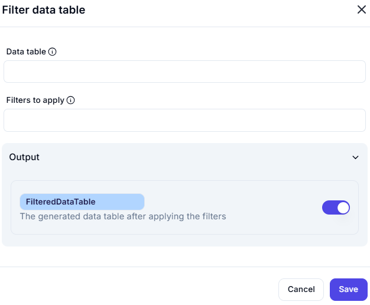

# Filter Data Table

This action is used to apply **filters** to an existing data table and return a **filtered data table** as output.

---

## Configuration Options

### Data table
  Provide the data table object you want to filter.  
  *(Required)*

### Filter Expression
  Define the filtering logic or expression (e.g., column name, condition, value).
---

### Output:
- **FilteredDataTable**  
  This is the **FilteredDataTable** after filters have been applied to the original data.  
  The output will contain only the rows that match the specified filter conditions.

---

### Example Use Case:
Suppose you have a table of employee records and want to filter out only those with a salary greater than `$50,000`.

- **Data table:** `EmployeeTable`
- **Filters to apply:** `Salary > 50000`

The output `FilteredDataTable` will contain only the rows where employees have a salary greater than 50,000.

---

### Notes:
- Make sure the column names used in the filter exist in the data table.
- You can chain multiple conditions using logical operators (e.g., `AND`, `OR`).
- If the filtering syntax is incorrect or the table is empty, the output will be blank.

---

### Output Variable Tip:
Toggle the switch to enable or disable the output variable `FilteredDataTable` to be used in subsequent steps in your flow.

---
