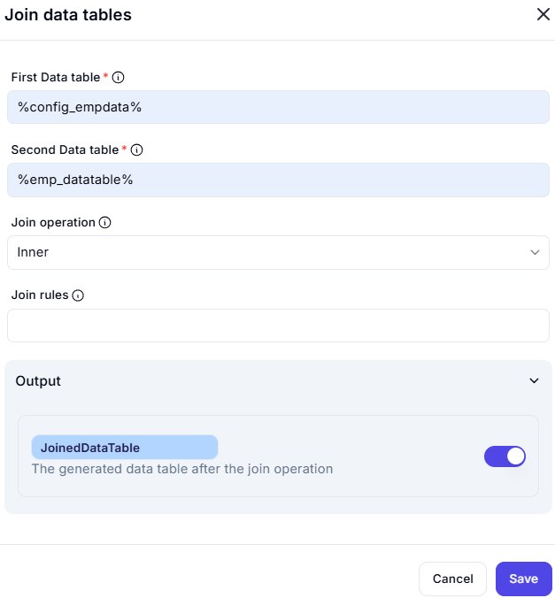

# Join Data Tables

This interface is used to join two different data tables based on a specific join operation. It's useful in scenarios where you want to merge data sets based on common columns (keys).

---
## Configuration Options

### First Data Table
- **Value**: `%config_empdata%`
- **Description**: The primary data table that will be used as the base for the join. This likely contains the configuration or reference employee data.

### Second Data Table
- **Value**: `%emp_datatable%`
- **Description**: The secondary data table that will be joined with the first table. It contains employee-specific data that needs to be merged with the configuration data.

---
## Join Configuration

### Join Operation
- **Selected Option**: `Inner`
- **Description**: Specifies the type of join operation.
  - **Inner Join** means only the rows with matching values in both tables will be included in the result.
  - Other possible join types (not selected here) could include:
    - `Left`
    - `Right`
    - `Full outer`

### Join Rules
- **Value**: _Empty_
- **Description**: Join rules define which columns from each table are to be used for matching data. Since this is blank, the user has not yet specified which columns should be used to join the tables.

---
## Output Section

### Output Variable
- **Variable Name**: `JoinedDataTable`
- **Description**: This variable stores the resulting data table after the join operation has been performed.
- **Toggle Status**: Enabled

---

### Notes:
- Fields marked with a red asterisk (*) are required.
- The info icons 🛈 beside field names typically provide tooltips or inline help when hovered over.
- Ensuring the correct join rules are set is crucial for accurate data merging.

