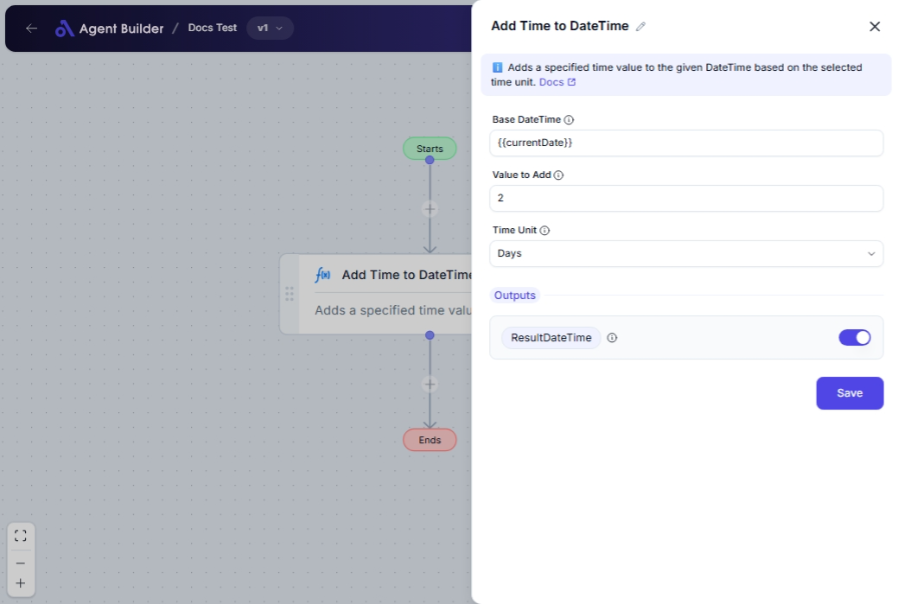

import { Callout, Steps } from "nextra/components";

# Add Time to DateTime

The **Add Time to DateTime** node lets you modify a DateTime by adding a specific amount of time. With this node, you can calculate future or past dates by adding or subtracting time in various units such as seconds, minutes, hours, days, months, or years.

This is useful when you need to:

- Schedule tasks or events at a future date and time.
- Calculate deadlines or expiry dates.
- Determine age or duration changes over time.

{/*  */}

## Configuration Options

| Field Name        | Description                                                                | Input Type | Required? | Default Value |
| ----------------- | -------------------------------------------------------------------------- | ---------- | --------- | ------------- |
| **Base DateTime** | The original DateTime value to which the time should be added.             | Text       | Yes       | _(empty)_     |
| **Value to Add**  | The numeric value of time to add to the DateTime.                          | Text       | Yes       | _(empty)_     |
| **Time Unit**     | Specifies the unit of time (Seconds, Minutes, Hours, Days, Months, Years). | Select     | Yes       | Days          |

## Expected Output Format

The output is an **Updated DateTime** value which is the new DateTime after the specified time has been added to the original DateTime.

## Step-by-Step Guide

<Steps>
### Step 1

Add the **Add Time to DateTime** node into your flow.

### Step 2

In the **Base DateTime** field, input the original date and time you want to modify.

### Step 3

Enter the numerical value in the **Value to Add** field that represents how much time you would like to add.

### Step 4

In the **Time Unit** dropdown, select the unit of time you wish to use for the addition:

- **Seconds**
- **Minutes**
- **Hours**
- **Days**
- **Months**
- **Years**

### Step 5

The adjusted DateTime will be available as **ResultDateTime** for use in subsequent nodes.

</Steps>

<Callout type="info" title="Tip">
  Consider using various units in different scenarios for better precision and
  flexibility. For example, use "Seconds" for operations that require high
  precision.
</Callout>

## Input/Output Examples

| Base DateTime       | Value to Add | Time Unit | Output Value        |
| ------------------- | ------------ | --------- | ------------------- |
| 2023-10-01T12:00:00 | 5            | Days      | 2023-10-06T12:00:00 |
| 2023-10-01T09:30:00 | 90           | Minutes   | 2023-10-01T11:00:00 |
| 2023-01-01T00:00:00 | 1            | Years     | 2024-01-01T00:00:00 |

## Common Mistakes & Troubleshooting

| Problem                                      | Solution                                                                                         |
| -------------------------------------------- | ------------------------------------------------------------------------------------------------ |
| **Invalid DateTime format in Base DateTime** | Ensure your date and time input matches the required format (e.g., `2023-10-01T12:00:00`).       |
| **Non-numeric value in Value to Add**        | The value must be numeric. Avoid entering letters or symbols.                                    |
| **Incorrect time unit chosen**               | Double-check your unit of measure; adding days instead of months, for example, changes outcomes. |

## Real-World Use Cases

- **Event Scheduling**: Automatically calculate and adjust event dates by adding days, weeks, or months.
- **Deadline Management**: Track and update deadlines by adding or subtracting time values.
- **Logistics and Planning**: Adjust shipment and delivery dates based on transit time.
