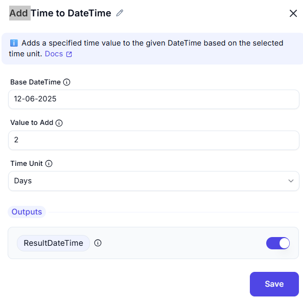

# Add to Datetime

## UI Components
1. **Date Time Input**:
   - Field type: Datetime picker/text input
   - Format: System locale or ISO-8601
   - Default: Current datetime (when empty)

2. **Time Unit Selection**:
   - Dropdown options:
     - Seconds (default)
     - Minutes
     - Hours
     - Days
     - Weeks
     - Months
     - Years

3. **Value to Add**:
   - Numeric input field
   - Accepts positive/negative values
   - Decimal values supported for smaller units

4. **Output Variable**:
   - Name: `ResultedDate`
   - Type: Datetime object
   - Description: Stores the calculated datetime

## Calculation Rules
| Unit    | Behavior                          | Examples                     |
|---------|-----------------------------------|------------------------------|
| Seconds | Adds exact seconds                | 30 → +30 seconds             |
| Minutes | Adds exact minutes (×60 seconds)  | 1.5 → +90 seconds            |
| Hours   | Adds exact hours (×3600 seconds)  | -2 → -7200 seconds           |
| Days    | Adds calendar days                | Accounts for DST changes      |
| Weeks   | Adds 7 calendar days              | 2 → +14 days                 |
| Months  | Adds calendar months              | Jan 31 + 1 month → Feb 28/29 |
| Years   | Adds calendar years               | Leap year aware              |

## Edge Case Handling
1. **Month Overflow**:
   - Jan 31 + 1 month → Feb 28/29
   - Mar 31 + 1 month → Apr 30

2. **Daylight Saving Time**:
   - 1:30 AM + 24 hours → 1:30 AM (fall back)
   - 1:30 AM + 24 hours → 2:30 AM (spring forward)

3. **Leap Seconds**:
   - Treated as standard seconds

4. **Invalid Datetimes**:
   - Feb 30 → Automatically corrects to Feb 28/29
   - 25:00 time → Rolls over to next day

## Output Examples
| Base Date           | Operation       | Result               |
|---------------------|-----------------|----------------------|
| 2023-01-15 10:00:00 | +15 minutes     | 2023-01-15 10:15:00  |
| 2023-02-28 00:00:00 | +1 day          | 2023-03-01 00:00:00  |
| 2024-02-28 12:00:00 | +1 year         | 2025-02-28 12:00:00  |
| 2023-03-31 09:00:00 | -1 month        | 2023-02-28 09:00:00  |

## Error Handling
- **Empty Input**: Uses current datetime
- **Invalid Unit**: Defaults to seconds
- **Non-numeric Value**: Treated as 0
- **Overflow**: Handles up to 9999-12-31

## Best Practices
1. For precise intervals:
   - Use seconds/minutes/hours
   - Avoid months/years for exact durations

2. For calendar calculations:
   - Use days/weeks/months/years
   - Test across DST transitions

3. For financial calculations:
   - Combine with business day logic
   - Account for holidays separately

## Timezone Considerations
- All calculations use input datetime's timezone
- No automatic timezone conversion
- UTC recommended for global systems

## Platform Limits
| Aspect              | Constraint                    |
|---------------------|-------------------------------|
| Minimum Date        | 0001-01-01 (system dependent) |
| Maximum Date        | 9999-12-31                    |
| Smallest Unit       | Nanoseconds (system dependent)|
| Largest Single Add  | ±10,000 years                 |

## Version Notes
1.0 - Basic arithmetic addition
1.1 - Added calendar-aware month/year handling
1.2 - Improved DST transition handling
1.3 - Added negative value support