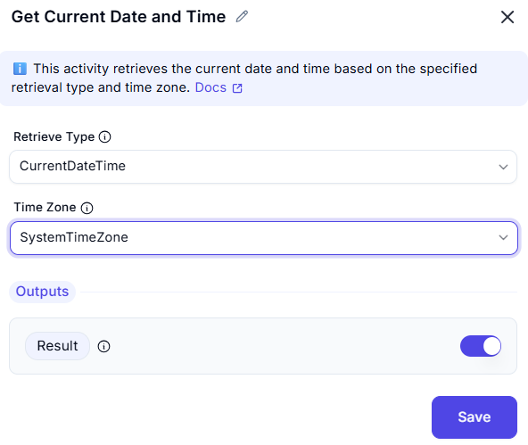

# Get Current Date and Time

This operation retrieves the current date and time based on the specified time zone settings.

## Configuration Options

| Parameter            | Value                  | Description |
|----------------------|------------------------|-------------|
| **Retrieve**        | `Current date and time` | Retrieves the current timestamp. |
| **Time zone**       | `System time zone`      | Uses the system's time zone for retrieval. |

## Output
- The retrieved current date and time based on the specified time zone.
- The output can be used for logging, scheduling, or timestamping events.
