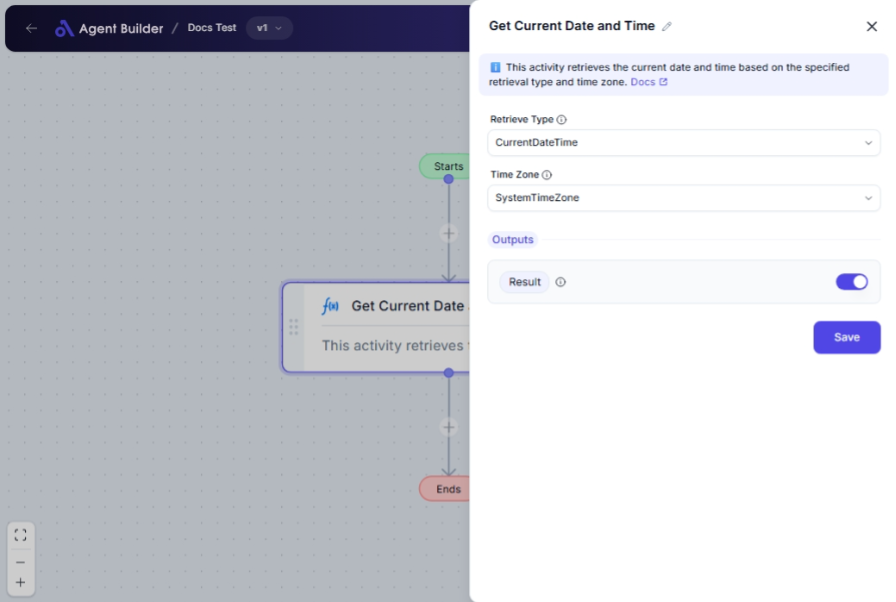

import { Callout, Steps } from "nextra/components";

# Get Current Date and Time

The **Get Current Date and Time** node is designed to provide you with the current date, time, or both based on your specific needs. This node is particularly useful when you need to timestamp events, schedule tasks, or log activities with precise temporal information.

For example:

- Retrieving the current date and time for logging events.
- Extracting just the current date for daily reports.
- Using a specific time zone to coordinate activities across regions.

{/*  */}

## Configuration Options

| Field Name        | Description                                                                                                  | Input Type | Required? | Default Value   |
| ----------------- | ------------------------------------------------------------------------------------------------------------ | ---------- | --------- | --------------- |
| **Retrieve Type** | Choose the type of date/time information to retrieve: either the full date and time or just the date.        | Select     | Yes       | CurrentDateTime |
| **Time Zone**     | Select the time zone from which the date and time should be retrieved, ensuring the correct contextual time. | Select     | Yes       | SystemTimeZone  |

## Expected Output Format

The output of this node is a **datetime value** based on the selected options.

- If you choose "Current Date and Time": the output will be a full datetime string (e.g., `2023-11-02T15:23:01`).
- If you select "Current Date Only": the output will be a date string (e.g., `2023-11-02`).

## Step-by-Step Guide

<Steps>
### Step 1

Add the **Get Current Date and Time** node into your workflow.

### Step 2

In the **Retrieve Type** dropdown, select whether you want to retrieve the "Current Date and Time" or just the "Current Date Only".

### Step 3

In the **Time Zone** dropdown, choose the appropriate time zone for your requirements:

- **System Time Zone**: Uses your system's current time zone settings.
- **Specific Time Zone**: Define a specific time zone manually.
- **Windows Time Zone**: Align with Windows' time zone settings.
- **Custom Input**: Allows you to input a custom time zone string if needed.

### Step 4

The result will automatically populate as **Result**, available for further use within other nodes.

</Steps>

<Callout type="info" title="Evening Warning">
  Ensure that you choose the accurate time zone to avoid any inaccuracies in
  time-sensitive applications.
</Callout>

## Input/Output Examples

| Retrieve Type         | Time Zone Option | Output Example        | Output Type       |
| --------------------- | ---------------- | --------------------- | ----------------- |
| Current Date and Time | SystemTimeZone   | `2023-11-02T15:23:01` | DateTime (String) |
| Current Date Only     | SpecificTimeZone | `2023-11-02`          | Date (String)     |

## Common Mistakes & Troubleshooting

| Problem                             | Solution                                                                          |
| ----------------------------------- | --------------------------------------------------------------------------------- |
| **Incorrect Time Zone**             | Double-check and select the correct time zone that aligns with your requirements. |
| **Invalid Retrieve Type Selection** | Ensure you've chosen a valid option in the **Retrieve Type** dropdown.            |
| **Unexpected Date/Time Format**     | Review the node configuration to ensure the desired precision and format are set. |

## Real-World Use Cases

- **Event Logging**: Timestamp entries in a log file for audit trails or debugging processes.
- **Daily Reports**: Retrieve the current date to generate or update daily reports automatically.
- **Task Scheduling**: Use accurate time stamps and zones to trigger time-based operations reliably across global operations.
