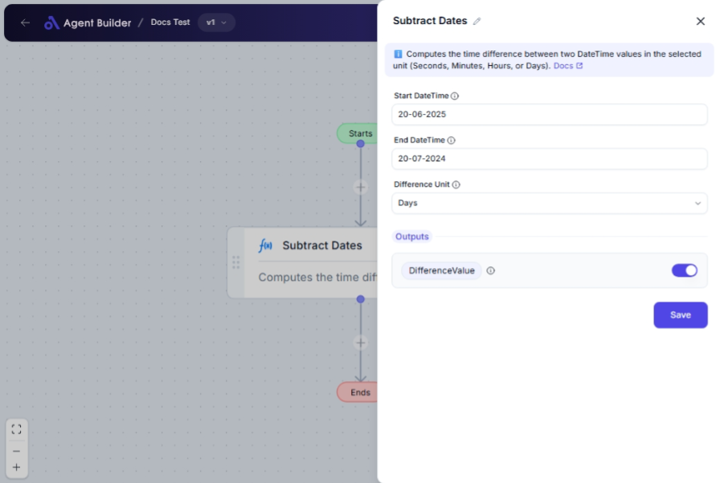

import { Callout, Steps } from "nextra/components";

# Subtract Dates

The **Subtract Dates** node allows you to calculate the difference between two dates and times. This is useful for determining the duration between two events, which can be important for tasks like scheduling, project timelines, or calculating age.

Using this node, you can:

- Find the time elapsed from a start date to an end date.
- Measure time in various units such as seconds, minutes, hours, or days.
- Apply calculations in workflows where time intervals are crucial.

## Configuration Options

| Field Name          | Description                                                | Input Type | Required? | Default Value |
| ------------------- | ---------------------------------------------------------- | ---------- | --------- | ------------- |
| **Start DateTime**  | The earlier DateTime value to subtract from.               | Text       | Yes       | _(empty)_     |
| **End DateTime**    | The later DateTime value to subtract.                      | Text       | Yes       | _(empty)_     |
| **Difference Unit** | Specifies the unit in which to return the time difference. | Select     | Yes       | Days          |

## Expected Output Format

The output is a **single numeric value** representing the time difference between the two dates in the specified unit.

- Simple integer representing the magnitude of the time difference (e.g., `3`, `45`, `128`).

## Step-by-Step Guide

<Steps>
### Step 1

Add the **Subtract Dates** node into your flow.

### Step 2

In the **Start DateTime** field, enter the date and time from which you want to start the calculation (e.g., `2023-01-01 10:00:00`).

### Step 3

In the **End DateTime** field, enter the date and time up to which you want to calculate the difference (e.g., `2023-01-02 10:00:00`).

### Step 4

Select the **Difference Unit** from the dropdown menu. You can choose any of the following:

- **Seconds**: Returns the difference in seconds.
- **Minutes**: Returns the difference in minutes.
- **Hours**: Returns the difference in hours.
- **Days**: Returns the difference in days.

### Step 5

The calculated time will be available as **DifferenceValue** for use in other nodes.

</Steps>

<Callout type="info" title="Tip">
  If your operation requires precise measurement, remember that the "Start
  DateTime" should be earlier than the "End DateTime".
</Callout>

## Input/Output Examples

| Start DateTime        | End DateTime          | Difference Unit | Output Value | Output Type |
| --------------------- | --------------------- | --------------- | ------------ | ----------- |
| `2023-01-01 10:00:00` | `2023-01-01 12:00:00` | Hours           | 2            | Number      |
| `2023-01-01 10:00:00` | `2023-01-02 10:00:00` | Days            | 1            | Number      |
| `2023-01-01 10:00:00` | `2023-01-01 10:10:00` | Minutes         | 10           | Number      |
| `2023-01-01 10:00:00` | `2023-01-01 10:00:30` | Seconds         | 30           | Number      |

## Common Mistakes & Troubleshooting

| Problem                            | Solution                                                                                              |
| ---------------------------------- | ----------------------------------------------------------------------------------------------------- |
| **Non-date values entered**        | Ensure you enter valid date-time strings in `YYYY-MM-DD HH:MM:SS` format.                             |
| **Negative time difference**       | Make sure that the **Start DateTime** is earlier than the **End DateTime**.                           |
| **Incorrect time difference unit** | Verify that you selected the appropriate unit for your operation in the **Difference Unit** dropdown. |

## Real-World Use Cases

- **Project Management**: Calculate the number of days remaining until a project deadline.
- **Event Planning**: Determine the number of hours left until the start of an event.
- **Contract Duration**: Compute how many years an agreement has been in place.
- **Maintenance Scheduling**: Measure the time since last equipment service to plan future maintenance.
