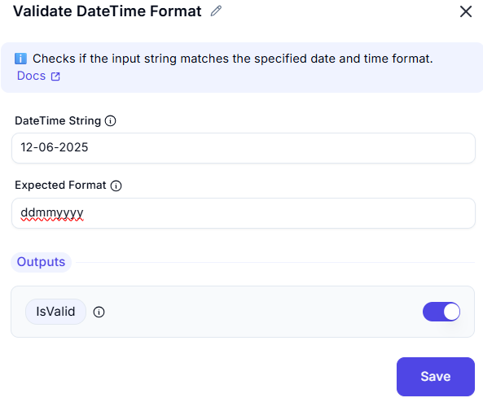

# Validate DateTime Format

## Overview
The **Validate DateTime Format** action is used to verify whether a given date-time string matches a predefined format. This is crucial in automation workflows to ensure that date values are correctly formatted before further processing, storage, or integration.


---

### Input Fields:
- **DateTime String**:  
  `12-06-2025`  
  This is the input date string that needs to be validated.

- **Expected Format**:  
  `ddmmyyyy` *(incorrect format in this case)*

### Correct Format:
To match the input string `12-06-2025`, the correct format should be:
```plaintext
dd-MM-yyyy
```

### Output
- **IsValid**: Boolean output (true / false) indicating whether the input string complies with the expected format.