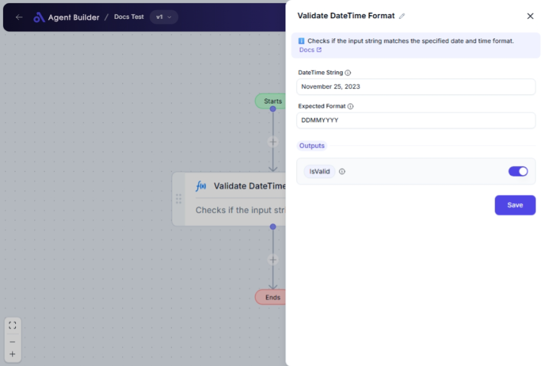

import { Callout, Steps } from "nextra/components";

# Validate DateTime Format

The **Validate DateTime Format** node is designed to help you ensure that your date and time strings are formatted correctly according to a specified pattern. This is particularly useful for validating input data before it's processed or stored, helping to avoid errors in databases or applications that rely on specific date formats.

For example:

- Verify if a user-inputted date string matches the expected format.
- Ensure consistent date formatting in documents or reports.

{/*  */}

## Configuration Options

| Field Name          | Description                                                             | Input Type | Required? | Default Value |
| ------------------- | ----------------------------------------------------------------------- | ---------- | --------- | ------------- |
| **DateTime String** | The date and time string you need to validate.                          | Text       | Yes       | _(empty)_     |
| **Expected Format** | The format pattern the date should match (e.g., `yyyy-MM-dd HH:mm:ss`). | Text       | Yes       | _(empty)_     |

## Expected Output Format

The output of this node is a **Boolean value** (`true` or `false`).

- `true`: Indicates that the date and time string matches the specified format.
- `false`: Indicates that the string does not conform to the expected format.

## Step-by-Step Guide

<Steps>
### Step 1

Add **Validate DateTime Format** node into your flow.

### Step 2

In the **DateTime String** field, enter the string representing the date and time that you want to validate.

### Step 3

In the **Expected Format** field, specify the format pattern you expect the date and time to match. For example, use `yyyy-MM-dd HH:mm:ss` for a format like 2023-12-31 23:59:59.

### Step 4

The output **Is Format Valid** will be available as `IsValid`. If the string format matches your specified pattern, this will return `true`; otherwise, it will return `false`.

</Steps>

<Callout type="info" title="Tip">
  Double-check your expected format string against common patterns to ensure it
  accurately reflects what you’re validating.
</Callout>

## Input/Output Examples

| DateTime String     | Expected Format       | Is Format Valid |
| ------------------- | --------------------- | --------------- |
| 2023-11-25 15:30:00 | yyyy-MM-dd HH:mm:ss   | true            |
| 11/25/2023          | yyyy-MM-dd HH:mm:ss   | false           |
| 2023-11-25T15:30:00 | yyyy-MM-dd'T'HH:mm:ss | true            |
| November 25, 2023   | MMMM d, yyyy          | true            |

## Common Mistakes & Troubleshooting

| Problem                                       | Solution                                                                                                                                    |
| --------------------------------------------- | ------------------------------------------------------------------------------------------------------------------------------------------- |
| **Incorrect Expected Format**                 | Ensure your format pattern matches the one you're validating against exactly, including any required separators or specific string formats. |
| **Non-date input entered in DateTime String** | Only input valid date strings. Avoid text that's not a date and time representation.                                                        |
| **Unexpected false result**                   | Check for any typos or discrepancies in the input string or format pattern, even small errors can impact validation.                        |

## Real-World Use Cases

- **User Form Validation**: Confirm that date inputs in user forms follow required formats before submission.
- **Data Import Checks**: Verify date formats in imported data files (e.g., CSV files) to ensure they will process correctly.
- **Report Generation**: Validate date entries to avoid errors in automated report generation processes.
