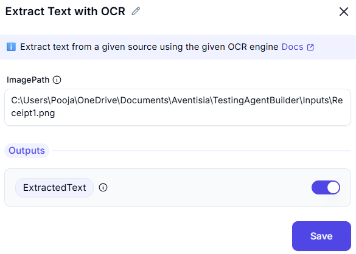

# Extract Text With OCR 

## Description
When this function is invoked, it takes an input image or document and analyzes the visual 
content to detect and recognize any embedded characters. The OCR engine then converts this visual information into machine-encoded text. This extracted text can be further used for data validation, storage, analytics, or integration with other systems.

### Input Configuration  
- **ImagePath**: image or png file path  

### Output
- **ExtractedText**: Output variable  

## Purpose
This function enables automation workflows to understand and process image-based data that would otherwise be inaccessible in its raw format. It is especially useful in scenarios involving digitized forms, invoices, handwritten notes, ID cards, and screenshots.

## Common Use Cases
- Extracting invoice numbers and totals from scanned bills.
- Capturing user details from ID cards or application forms.
- Reading data from screenshots or image-based reports.
- Automating document processing workflows where input is not text-readable.