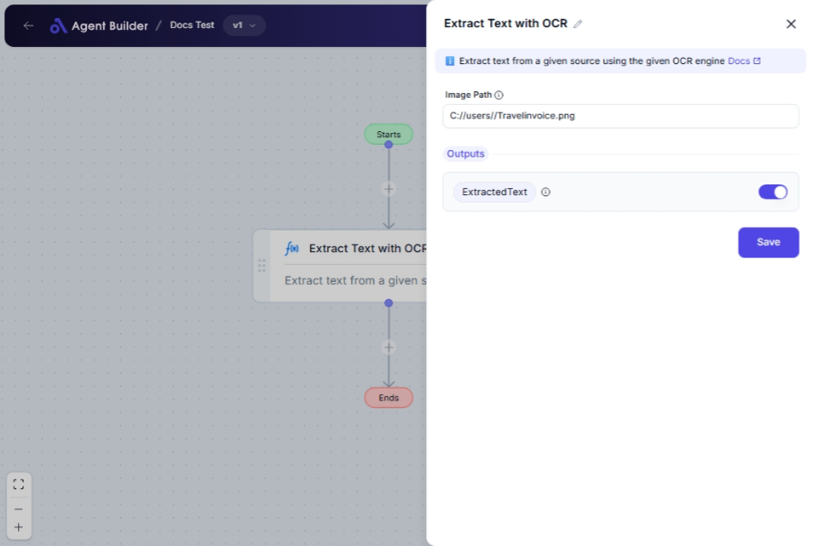

import { Callout, Steps } from "nextra/components";

# Extract Text with OCR

The **Extract Text with OCR** node enables you to convert text within an image file into editable text format by using Optical Character Recognition (OCR) technology. This is especially useful if you want to digitize printed documents, convert photos with text into data you can edit, or automate text extraction from images for use in other workflows.

## Configuration Options

| Field Name     | Description                        | Input Type | Required? | Default Value |
| -------------- | ---------------------------------- | ---------- | --------- | ------------- |
| **Image Path** | File path of the image to process. | Text       | Yes       | _(empty)_     |

## Expected Output Format

The output is a **string** containing the extracted text from the provided image. The output will be available as **ExtractedText** for further use in your flow.

## Step-by-Step Guide

<Steps>
### Step 1

Add the **Extract Text with OCR** node into your workflow.

### Step 2

In the **Image Path** field, enter the path to the image file from which you want to extract text. Ensure the path is correct and points to an accessible file on your system.

### Step 3

Once configured, the node will process the image and produce the extracted text as output, available under **ExtractedText**.

</Steps>

<Callout type="info" title="Tip">
  Ensure that the image contains clear and legible text for more accurate OCR
  results. High-quality images yield better extraction.
</Callout>

## Input/Output Examples

| Input Image Path         | Extracted Output Text                        | Output Type |
| ------------------------ | -------------------------------------------- | ----------- |
| `/images/sample-doc.png` | "This is the extracted text from the image." | String      |

## Common Mistakes & Troubleshooting

| Problem               | Solution                                                                                                                         |
| --------------------- | -------------------------------------------------------------------------------------------------------------------------------- |
| **Invalid file path** | Double-check the image path for accuracy. Ensure the file exists and the path is correctly specified.                            |
| **Poor OCR quality**  | Make sure the image is of high quality and the text within the image is readable. Improper lighting or focus can affect results. |

## Real-World Use Cases

- **Digitizing Documents**: Convert scanned documents into digital text for easy editing and storage.
- **Data Entry**: Automatically pull text from scanned forms into databases, reducing manual entry errors.
- **Archiving**: Create editable and searchable archives from paper documents for easier access and retrieval.
