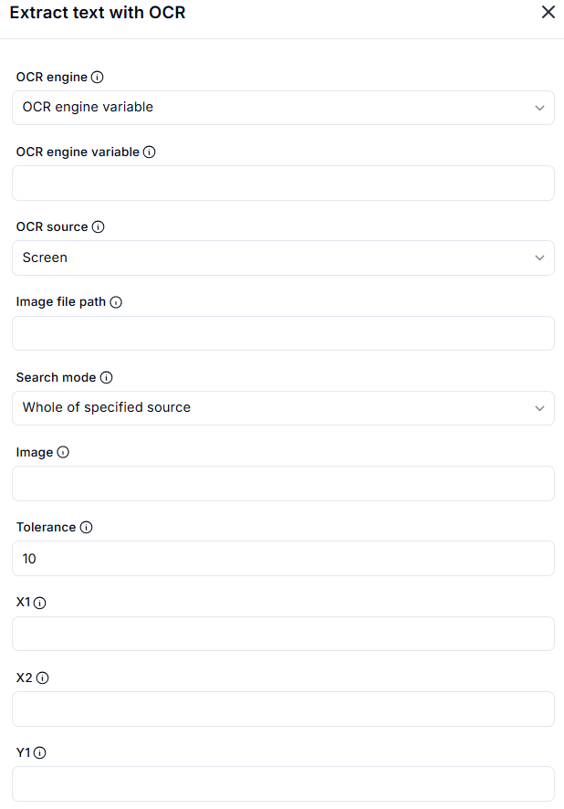
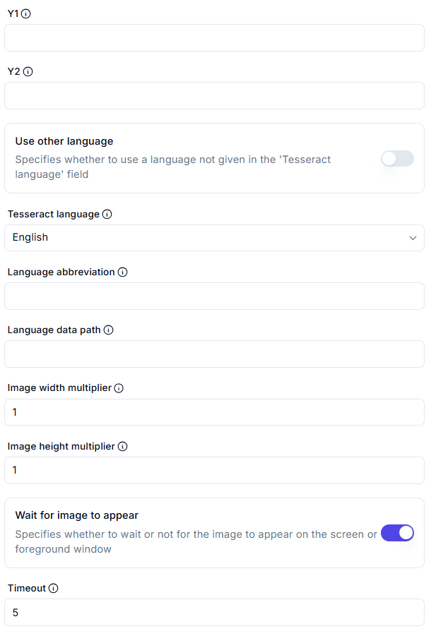
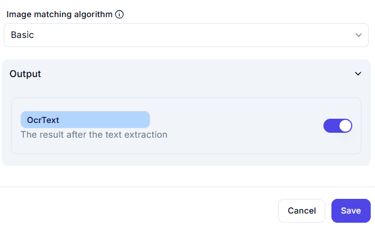

# Extract Text With OCR

## Core Settings
- **OCR Engine**:  
  - Dropdown selector with variable assignment option  
  - Field label: `OCR engine variable` for storing the engine reference  

## Source Configuration
- **OCR Source**:  
  - Radio buttons: `Screen` (default) | `Image file path` (with input field)  
- **Search Mode**:  
  - Fixed to `Whole of specified source`  
- **Image Preview Area**:  
  - Visual display for screen/image capture  

## Image Parameters
- **Tolerance**:  
  - Default value: `10` (slider/input field)  
- **Coordinates**:  
  - Required fields marked with ①:  
    - `X1`, `X2`, `Y1`, `Y2` (numerical inputs)  

## Language Settings
- **Primary Language**:  
  - Dropdown: `Tesseract language` (default: English)  
  - Marked as required ①  
- **Alternative Language Options**:  
  - Checkbox: `Use other language`  
  - Dependent fields (marked ① when enabled):  
    - `Language abbreviation` (text input)  
    - `Language data path` (file path input)  

## Image Processing
- **Scaling**:  
  - `Image width multiplier`: Default `1` (required ①)  
  - `Image height multiplier`: Default `1` (required ①)  
- **Wait Behavior**:  
  - Checkbox: `Wait for image to appear`  
  - `Timeout`: Default `5` seconds (required ①)  
- **Matching Algorithm**:  
  - Dropdown: Default `Basic`  

## Output
- **Extracted Text**:  
  - Output variable: `OerText`  
 
## Technical Notes
1. Required fields are indicated with ① symbol  
2. Coordinate system starts from top-left corner (0,0)  
3. Timeout applies only when "Wait for image" is enabled  
4. Language data path requires valid .traineddata files for custom languages  

## Recommended Values
| Parameter        | Typical Range  | Notes                     |
|-----------------|---------------|---------------------------|
| Tolerance       | 5-15          | Higher=more fuzzy matches |
| Timeout         | 3-30 seconds  | Depends on system speed   |
| Image multipliers | 0.5-2.0     | Adjust for DPI scaling    |