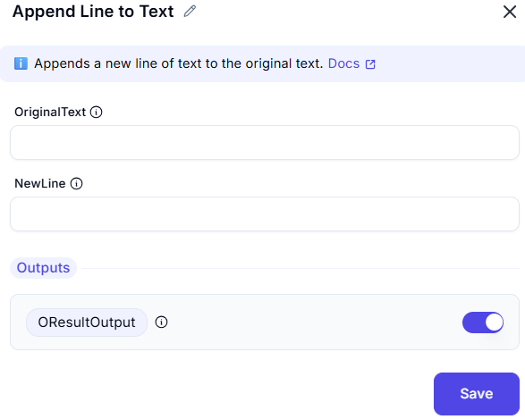

# **Append Line to Text**

## **Description**

This operation appends a new line of text to an existing text value.

## **Input Parameters**

| Parameter         | Value        | Description |
|------------------|-------------|-------------|
| **Original Text** | `Pune`      | The initial text to which a new line will be appended. |
| **NewLine** | `Maharashtra` | The text that will be added to the original text. |

## **Output**

| Parameter  | Description |
|------------|-------------|
| **ResultOutput** | The updated text after appending the new line. |

## **Effect**

- Combines the **original text** and the **appended text** into a single string.
- Useful for formatting text dynamically, such as building addresses or structured content.

## **Example Use Case**

- **Scenario:** A user wants to store a **city** and **state** together.
- **Configuration:**
  - Original Text: `Pune`
  - Line to Append: `Maharashtra`
- **Result:** The output will be:
  - Pune
  - Maharashtra