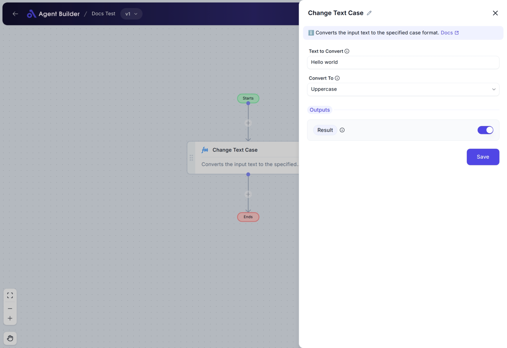

import { Callout, Steps } from "nextra/components";

# Change Text Case

The **Change Text Case** node allows you to automatically adjust the letter casing of any text you provide. You can convert your text into **uppercase**, **lowercase**, **title case**, or **sentence case** without manually editing it. This is helpful when you want to ensure text formatting consistency, such as standardizing names, titles, or other text fields in your workflows.

For example:

- Make all letters uppercase for emphasis.
- Change text to lowercase for uniform data processing.
- Apply title case to names or titles.
- Use sentence case for regular sentence formatting.

## Configuration Options

| Field Name          | Description                                                                       | Input Type | Required? | Default Value |
| ------------------- | --------------------------------------------------------------------------------- | ---------- | --------- | ------------- |
| **Text to Convert** | The text you want to change the case of.                                          | Text       | No        | _(empty)_     |
| **Convert To**      | Choose the target case style: Uppercase, Lowercase, Title Case, or Sentence Case. | Select     | No        | _(empty)_     |
| **Result**          | The output field showing the converted text. You can use this in later nodes.     | Output     | No        | Result        |

## Expected Output Format

The output is a **text string** showing the converted version of the original input based on your selected case style.

- Example: If you select "Uppercase", the output will be all capital letters.
- The output is accessible as **Result** for use in other nodes.

## Step-by-Step Guide

<Steps>
### Step 1

Add the **Change Text Case** node into your flow using the **Add Node** option.

### Step 2

In the **Text to Convert** field, type or select the text you want to change. This can be plain text (like "hello world") or text coming from another node.

### Step 3

In the **Convert To** dropdown, choose how you want to change the text:

- **Uppercase**: Converts all letters to capital letters.
- **Lowercase**: Converts all letters to small letters.
- **Title Case**: Capitalizes the first letter of each word.
- **Sentence Case**: Capitalizes the first letter of the sentence and makes the rest lowercase.

### Step 4

Check the **Result** output field to see the converted text. You can now use this result in other nodes in your automation flow.

</Steps>

<Callout type="info" title="Note">
  If you leave the **Text to Convert** field empty, the node will not process
  any text. Always make sure to provide text input or connect it from another
  node.
</Callout>

## Input/Output Examples

| Text to Convert | Convert To    | Output Result | Output Type |
| --------------- | ------------- | ------------- | ----------- |
| "hello world"   | Uppercase     | "HELLO WORLD" | Text        |
| "HELLO WORLD"   | Lowercase     | "hello world" | Text        |
| "hello world"   | Title Case    | "Hello World" | Text        |
| "hello world"   | Sentence Case | "Hello world" | Text        |

## Common Mistakes & Troubleshooting

| Problem                                        | Solution                                                                                                          |
| ---------------------------------------------- | ----------------------------------------------------------------------------------------------------------------- |
| **Output is blank or "Result" is not updated** | Make sure you provided valid text in the **Text to Convert** field and selected a valid option in **Convert To**. |
| **Unexpected output format**                   | Double-check the **Convert To** dropdown to ensure you selected the correct case style.                           |
| **Forget to connect input from previous node** | If you're using text from another node, ensure that node's output is properly connected to this node's input.     |

## Real-World Use Cases

- **Customer Name Formatting**: Ensure all customer names appear in **Title Case** for consistency (e.g., "john doe" → "John Doe").
- **Report Generation**: Convert headings or sections into **Uppercase** for emphasis in auto-generated reports.
- **Data Cleaning**: Standardize text fields (like product descriptions) into **Sentence Case** for better readability.
- **Email Automation**: Ensure dynamic text (like subject lines) follows proper case rules before sending.
