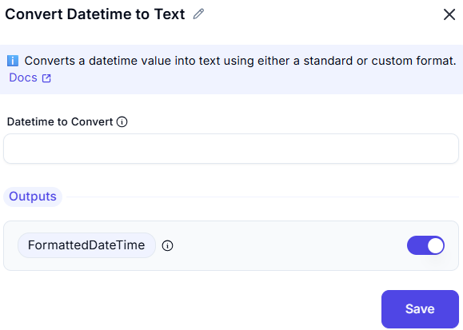

# Convert Datetime to Text

## Configuration Fields

- **Datetime to convert** ①  
- **Format to use** ①  
  *(Required format selector with options:)*
  - `Standard` (default locale format)
  - `Custom` (opens format pattern input)

## Output
- **Variable**: `formattedDateTime`  

## Supported Format Patterns
| Pattern | Example          | Description           |
|---------|-----------------|-----------------------|
| yyyy    | 2023            | 4-digit year         |
| MM      | 07              | 2-digit month        |
| dd      | 25              | 2-digit day          |
| HH      | 14              | 24-hour format       |
| mm      | 30              | Minutes              |
| ss      | 45              | Seconds              |
| zzz     | GMT+05:30       | Timezone offset      |

## Common Use Cases
1. **Reporting**:  
   `"Report generated on: ${formattedDateTime}"`
2. **File Naming**:  
   `"export_yyyy-MM-dd_HHmmss.txt"`

## Examples
| Input Datetime       | Format          | Output                     |
|----------------------|-----------------|----------------------------|
| 2023-07-25T14:30:00Z | Standard        | "Jul 25, 2023 2:30 PM"     |
| 2023-07-25T14:30:00Z | yyyy-MM-dd      | "2023-07-25"               |
| 2023-07-25T14:30:00Z | HH:mm:ss zzz    | "14:30:00 UTC"             |
| Now()                | dd/MM/yyyy HH:mm| "25/07/2023 14:30"         |

## Best Practices

1. Always specify timezone for UTC conversions
2. Use ISO-8601 for database operations
3. Test custom formats with edge cases:
   - Month-end dates
   - Daylight saving transitions
   - Leap seconds