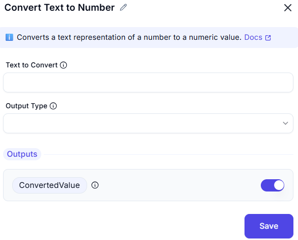

# Convert Text to Number

## Input Configuration
- **Text to convert** ①  
  

## Output Settings
- **Output variable**:  
  `TextAsNumber` *(Stores converted numeric value)*

## Function

1. Accepts alphanumeric input (e.g., "$1,234.56")
2. Performs automatic:
   - Thousand separators removal
   - Decimal point standardization
   - Non-numeric character stripping
3. Outputs:
   - Integer (e.g., "123" → 123)
   - Floating-point (e.g., "3.14" → 3.14)
   - `0` for non-convertible strings

## Usage Examples
| Input Text      | Output Value | Notes                  |
|----------------|-------------|-----------------------|
| "42"           | 42          | Integer conversion    |
| " 19.99 "      | 19.99       | Trims whitespace      |
| "$1,000"       | 1000        | Ignores symbols       |
| "Error"        | 0           | Fallback value        |

## Best Practices
1. Pre-trim whitespace when possible
2. Validate inputs before conversion
3. Combine with error checking for financial data