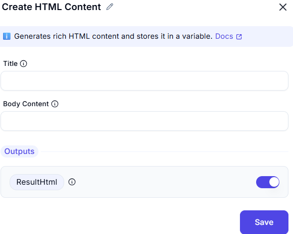

# Create HTML Content

This screenshot demonstrates a tool or interface designed to create and edit HTML content. The example provided shows an HTML editor where users can input text and generate corresponding HTML code.


---
## Input

- **Title**:
    - The title of the HTML document

- **Body Content**:
 - The body content of the HTML document.

**Example**
```plaintext
Hello Team,
Please find attached email
regards,
xyz
 ```
---
## Output

- **ResultHTML**:
- The generated HTML code based on the input text.
---

## Summary

This tool is useful for creating and editing HTML content, allowing users to input plain text and convert it into HTML format. It simplifies the process of generating HTML code for emails, web pages, or other digital content.