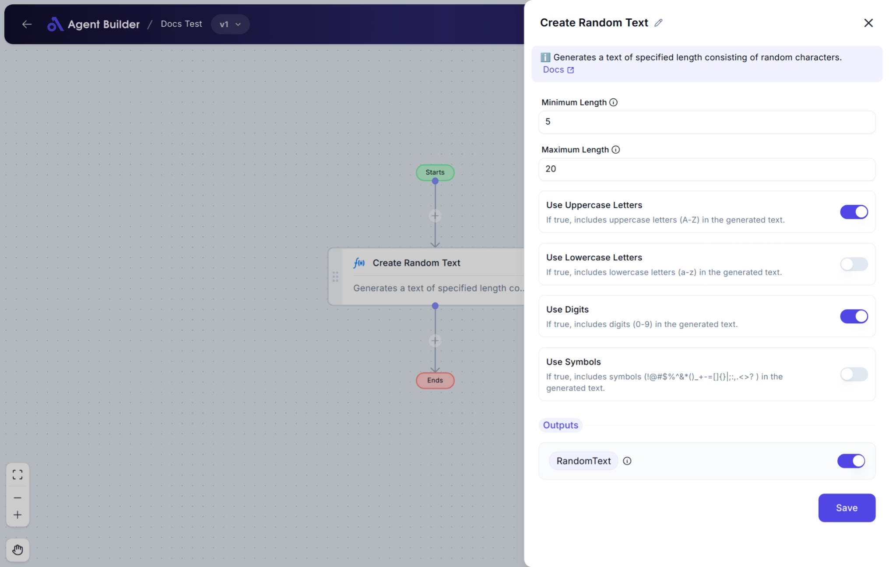

import { Callout, Steps } from "nextra/components";

# Create Random Text

The **Create Random Text** node lets you generate a random string of text based on your specified settings. This can be useful when you need random values for testing, generating unique IDs, passwords, or dummy data for documents and forms.

For example:

- Creating random passwords of a set length.
- Generating placeholder content for forms or files.
- Producing random strings for test cases.

## Configuration Options

| Field Name                | Description                                                         | Input Type | Required? | Default Value |
| ------------------------- | ------------------------------------------------------------------- | ---------- | --------- | ------------- |
| **Minimum Length**        | The smallest number of characters the generated text should have.   | Text       | Yes       | _(empty)_     |
| **Maximum Length**        | The largest number of characters the generated text should have.    | Text       | Yes       | _(empty)_     |
| **Use Uppercase Letters** | Include uppercase letters (A-Z) in the random text.                 | Switch     | No        | true          |
| **Use Lowercase Letters** | Include lowercase letters (a-z) in the random text.                 | Switch     | No        | true          |
| **Use Digits**            | Include numbers (0-9) in the random text.                           | Switch     | No        | true          |
| **Use Symbols**           | Include symbols (`!@#$%^&\*()\_+-=[]{};:,.<>?`) in the random text. | Switch     | No        |

## Expected Output Format

The output of this node is a **single text string** containing randomly selected characters based on your configuration. The length of the string will be between the **Minimum Length** and **Maximum Length** you set.

- **Output Name**: `RandomText`
- **Output Type**: Text (String)
- Example Output: `"aZ4kT8"` or `"!m9L#q@"`

## Step-by-Step Guide

<Steps>
### Step 1

Add the **Create Random Text** node to your flow using the **Add** option.

### Step 2

In the **Minimum Length** field, enter the smallest number of characters you want the random text to have. (e.g., `5`)

### Step 3

In the **Maximum Length** field, enter the largest number of characters you want the random text to have. (e.g., `10`)

### Step 4

Use the switches to select what types of characters should be included in the random text:

- **Use Uppercase Letters**: Toggle ON to include A-Z.
- **Use Lowercase Letters**: Toggle ON to include a-z.
- **Use Digits**: Toggle ON to include numbers 0-9.
- **Use Symbols**: Toggle ON to include special symbols (!@#$%^&\*...).

By default, uppercase, lowercase, and digits are included. Symbols are excluded unless you turn this ON.

### Step 5

The generated text will be available in the **Random Text** output field, labeled as `RandomText`.

</Steps>

<Callout type="info" title="Tip">
  Make sure your **Minimum Length** is less than or equal to your **Maximum
  Length** to avoid errors.
</Callout>

## Input/Output Examples

| Minimum Length | Maximum Length | Use Uppercase | Use Lowercase | Use Digits | Use Symbols | Example Output |
| -------------- | -------------- | ------------- | ------------- | ---------- | ----------- | -------------- |
| 5              | 10             | ON            | ON            | ON         | OFF         | `a9ZtP`        |
| 8              | 8              | OFF           | ON            | OFF        | OFF         | `qwertyui`     |
| 6              | 12             | ON            | ON            | ON         | ON          | `A7#d8!Lp`     |

## Common Mistakes & Troubleshooting

| Problem                                         | Solution                                                                                                |
| ----------------------------------------------- | ------------------------------------------------------------------------------------------------------- |
| **Minimum Length greater than Maximum Length**  | Make sure the value in **Minimum Length** is not higher than the value in **Maximum Length**.           |
| **Empty Output**                                | Ensure at least one character type (Uppercase, Lowercase, Digits, Symbols) is selected.                 |
| **Non-numeric values entered in length fields** | Enter only valid numbers in **Minimum Length** and **Maximum Length** fields. Avoid letters or symbols. |

## Real-World Use Cases

- **Password Generation**: Create random secure passwords for internal tools or temporary access.
- **Test Data Creation**: Generate dummy text for testing forms, fields, or database records.
- **Unique Code Generation**: Produce random codes or IDs for inventory, tickets, or vouchers.
- **Placeholder Content**: Fill in random text for layouts and UI mockups during design or prototyping.
