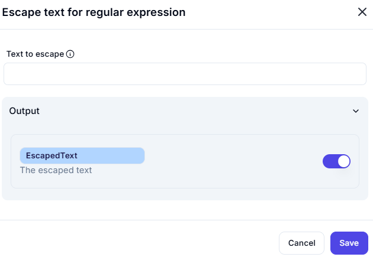

# Escape Text for Regular Expression

## Description
Escapes all special regular expression characters in input text to create regex-safe strings for dynamic pattern matching.

## UI Components
1. **Input Field**:
   - Label: "Text to escape"
   - Type: Text input (single/multi-line)
   - Required: Yes (implied by functionality)

2. **Output Variable**:
   - Name: `EscapedText`
   - Type: String
   - Description: Contains the escaped version of input text

## Processing Logic
1. **Input Handling**:
   - Trims whitespace from both ends
   - Converts non-string inputs to strings
   - Preserves all whitespace and newlines within text

2. **Escaping Process**:
   - Scans text character-by-character
   - Precedes each special character with backslash
   - Leaves alphanumeric and space characters unchanged

3. **Output Generation**:
   - Returns empty string for null/undefined input
   - Preserves original character casing
   - Maintains UTF-8 encoding for international characters
