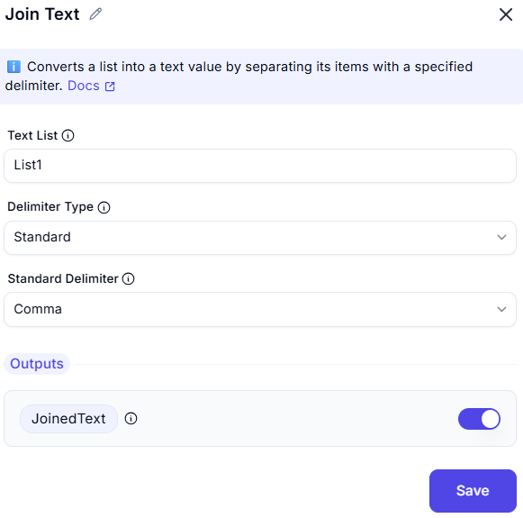

# Join Text

## **Description**

The **Join Text** operation concatenates elements from a list into a single string, separated by a specified delimiter.



---

## **Configuration Options**

| Parameter                            | Value        | Description |
|--------------------------------------|-------------|-------------|
| **Text List**         | `List1` | The list containing elements to be joined. |
| **Delimiter Type** | `Standard`    | The separator between concatenated list elements. |
| **Custom delimiter**                 | `Comma (,)`         | The specified delimiter for joining the text. |

---

## **Example Use Cases**

### **Example 1: Joining a List of Names**

#### **Input**

```python
List1 = ["Alice", "Bob", "Charlie"]
```

### **Output**

```python
Alice, Bob, Charlie
```

## **Summary**

- Combines **all elements** of the list into a single **joined string**.
- Uses the specified **custom delimiter** (`;` in this case) to separate elements.