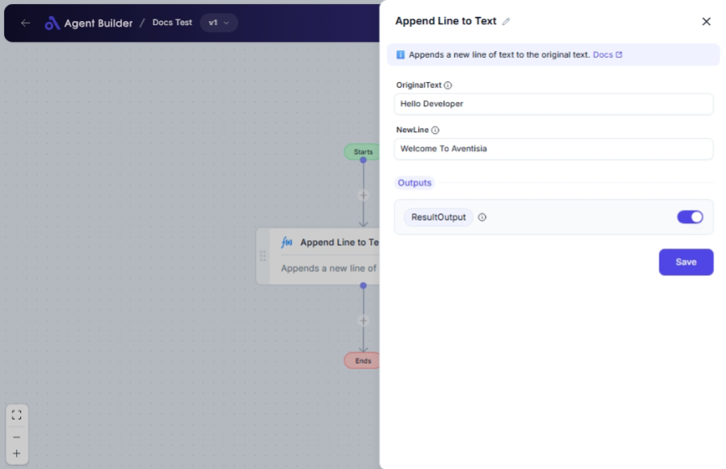

import { Callout, Steps } from "nextra/components";

# Append Line to Text

The **Append Line to Text** node allows you to effortlessly add a new line of text to an existing block of text. This is particularly useful when you want to programmatically extend text content for documents, logs, messages, and more without modifying the original text directly.

Examples of usage include:

- Adding a footer or signature line to a text.
- Appending additional data or records in log files or reports.
- Incrementally building larger text blocks from smaller snippets.

## Configuration Options

| Field Name        | Description                                             | Input Type | Required? | Default Value |
| ----------------- | ------------------------------------------------------- | ---------- | --------- | ------------- |
| **Original Text** | The original text to which a new line will be appended. | Text       | No        | _(empty)_     |
| **New Line**      | The new line of text to append.                         | Text       | No        | _(empty)_     |

## Expected Output Format

The output will be a **concatenated text string**. This string will combine the original text with the new line, separated by a newline character. This means that after appending, the new line will appear directly below the original content.

## Step-by-Step Guide

<Steps>
### Step 1

Add the **Append Line to Text** node into your flow.

### Step 2

In the **Original Text** field, enter the existing block of text to which you want to append a new line.

### Step 3

In the **New Line** field, enter the text that you wish to add to the original text.

### Step 4

The merged text can be found under **ResultOutput** and be used in subsequent nodes for further processing.

</Steps>

<Callout type="info" title="Tip">
  If either the **Original Text** or **New Line** is left empty, the node will
  still function by appending whatever text is provided. An empty field will
  result in no change from that specific input.
</Callout>

## Input/Output Examples

| Original Text           | New Line        | Output Value                      | Output Type   |
| ----------------------- | --------------- | --------------------------------- | ------------- |
| "Hello, World!"         | "Best Regards"  | "Hello, World!\nBest Regards"     | String (Text) |
| "User 1 logged in"      | "End of Report" | "User 1 logged in\nEnd of Report" | String (Text) |
| _(empty)_               | "First Entry"   | "First Entry"                     | String (Text) |
| "Summary of Sales: 100" | _(empty)_       | "Summary of Sales: 100"           | String (Text) |

## Common Mistakes & Troubleshooting

| Problem                            | Solution                                                                                          |
| ---------------------------------- | ------------------------------------------------------------------------------------------------- |
| **No Output Produced**             | Ensure you have at least one field filled with text. If both are empty, the output will be blank. |
| **Text Not Appending as Expected** | Check for missing newline characters or unexpected formatting in the text inputs.                 |

## Real-World Use Cases

- **Email Automation**: Automatically add standard greetings or closings to email templates.
- **Logging Systems**: Continuously append log entries with status messages or timestamps.
- **Document Building**: Programmatically assemble parts of a document (e.g., combining introduction and conclusion).
- **Customer Feedback**: Aggregate multiple feedback entries from users by appending each new comment to an initial text.
