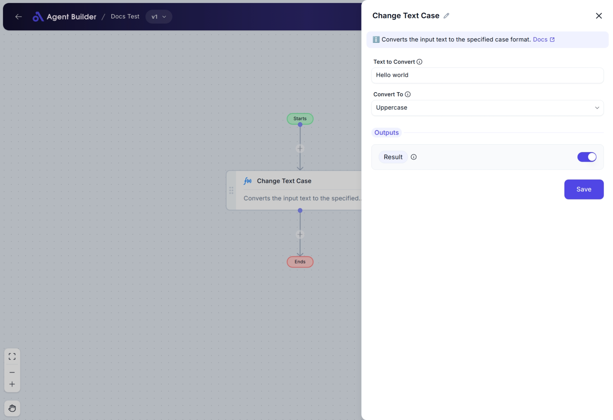

import { Callout, Steps } from "nextra/components";

# Change Text Case

The **Change Text Case** node allows you to modify the casing style of a text string. It converts texts into different formats such as uppercase, lowercase, sentence case, or title case. This node is particularly useful for standardizing text appearance in documents, emails, and data outputs.

For example:

- Converting text to all capital letters for emphasis.
- Making sure text is in lowercase for consistent data entry.
- Formatting a sentence properly by capitalizing the first word.
- Capitalizing each word in a title for publications or headings.

## Configuration Options

| Field Name          | Description                                                                     | Input Type | Required? | Default Value |
| ------------------- | ------------------------------------------------------------------------------- | ---------- | --------- | ------------- |
| **Text to Convert** | The text you want to change the case for.                                       | Text       | No        | _(empty)_     |
| **Convert To**      | Choose the desired case style: UPPERCASE, lowercase, Title Case, Sentence case. | Select     | No        | _(empty)_     |

## Expected Output Format

The output from the Change Text Case node is a **string of text** formatted in the case style you selected.

- **UPPERCASE**: All letters capitalized (e.g., "HELLO WORLD").
- **lowercase**: All letters in lowercase (e.g., "hello world").
- **Sentence case**: Only the first letter capitalized (e.g., "Hello world").
- **Title Case**: First letter of each word capitalized (e.g., "Hello World").

## Step-by-Step Guide

<Steps>
### Step 1

Add the **Change Text Case** node to your flow.

### Step 2

In the **Text to Convert** field, enter the text string you want to modify.

### Step 3

From the **Convert To** dropdown menu, select the desired case conversion option:

- **UPPERCASE**: Converts all characters to uppercase.
- **lowercase**: Converts all characters to lowercase.
- **Sentence case**: Capitalizes the first letter of the string.
- **Title Case**: Capitalizes the first letter of each word in the string.

### Step 4

The converted text will be available under **Result** for further use in other nodes.

</Steps>

<Callout type="info" title="Tip">
  The node does not require you to fill in any fields for it to function, but
  doing so ensures accurate transformation based on your needs. Leaving fields
  empty will result in no transformation and output will equal input.
</Callout>

## Input/Output Examples

| Text to Convert | Convert To   | Output        | Output Type |
| --------------- | ------------ | ------------- | ----------- |
| "hello world"   | UPPERCASE    | "HELLO WORLD" | String      |
| "HELLO WORLD"   | lowercase    | "hello world" | String      |
| "hello world"   | SentenceCase | "Hello world" | String      |
| "hello world"   | TitleCase    | "Hello World" | String      |

## Common Mistakes & Troubleshooting

| Problem                           | Solution                                                                                     |
| --------------------------------- | -------------------------------------------------------------------------------------------- |
| **Text not changing as expected** | Ensure you've chosen the correct case style from the **Convert To** dropdown.                |
| **No output is shown**            | Check if the **Text to Convert** field is empty; input is necessary for conversion to occur. |
| **Non-text input error**          | The node can only process text strings. Ensure no numerical or other data type is entered.   |

## Real-World Use Cases

- **Document Formatting**: Automatically format customer names in reports into title case.
- **Data Standardization**: Ensure input data is lowercase for database consistency.
- **Publication Headings**: Convert headlines to title case for blog articles.
- **Email Template Formatting**: Format text in marketing emails to sentence case for readability.
