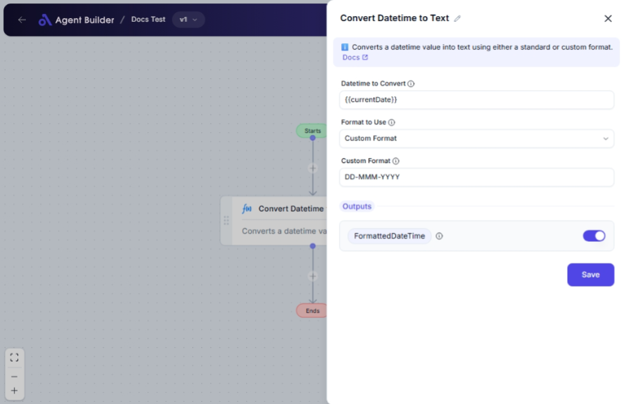

import { Callout, Steps } from "nextra/components";

# Convert Datetime to Text

The **Convert Datetime to Text** node converts a date and time value into a text format. This is especially useful when you need to display datetime information in a specific format for reports, user interfaces, or data transfers.

For example:

- Changing a datetime value to a readable format for reporting.
- Standardizing datetime formats for consistent data presentation.
- Using specific custom formats to meet business or locale requirements.

## Configuration Options

| Field Name              | Description                                                                                         | Input Type | Required? | Default Value |
| ----------------------- | --------------------------------------------------------------------------------------------------- | ---------- | --------- | ------------- |
| **Datetime to Convert** | The datetime value to convert to text.                                                              | Text       | No        | _(empty)_     |
| **Format to Use**       | Choose whether to use a standard datetime format or create a custom one.                            | Select     | No        | Standard      |
| **Standard Format**     | The standard datetime format to use (only appears if **Format to Use** is "Standard").              | Select     | No        | ShortDate     |
| **Custom Format**       | A custom format string for converting the datetime (only appears if **Format to Use** is "Custom"). | Text       | No        | _(empty)_     |

## Expected Output Format

The output of this node is a **text value** that represents the datetime in the chosen format. This can be a simple date, time, or a combined datetime string.

- For standard formats, the output will match the selected pattern (e.g., "01/01/2025", "3:45 PM").
- For custom formats, the output will follow the custom pattern you provide (e.g., "20250101" for "yyyyMMdd").

## Step-by-Step Guide

<Steps>
### Step 1

Add the **Convert Datetime to Text** node into your workflow.

### Step 2

In the **Datetime to Convert** field, enter the datetime you wish to format. This can be a direct input or a variable holding datetime information.

### Step 3

Select the **Format to Use** from the dropdown:

- **Standard Format**: Choose from predefined formatting options like "Short Date".
- **Custom Format**: Define your pattern that the datetime will be converted to.

### Step 4

If **Standard Format** is selected, pick a specific format from the **Standard Format** dropdown list.

### Step 5

If **Custom Format** is selected, type your desired datetime pattern in the **Custom Format** field (e.g., "yyyy/MM/dd").

### Step 6

The formatted datetime will be available as **FormattedDateTime** to be used in subsequent nodes or outputs.

</Steps>

<Callout type="info" title="Tip">
  The **Standard Format** options only appear when "Standard" is selected as the
  **Format to Use**. Conversely, the **Custom Format** field appears only if
  "Custom" is chosen.
</Callout>

## Input/Output Examples

| Format to Use | Datetime to Convert | Format              | Output Value               |
| ------------- | ------------------- | ------------------- | -------------------------- |
| Standard      | 2025-01-01T15:45:00 | Long Date           | Wednesday, January 1, 2025 |
| Standard      | 2025-01-01T15:45:00 | Short Time          | 3:45 PM                    |
| Custom        | 2025-01-01T15:45:00 | yyyy-MM-dd HH:mm:ss | 2025-01-01 15:45:00        |
| Custom        | 2025-01-01T15:45:00 | yyyyMMdd            | 20250101                   |

## Common Mistakes & Troubleshooting

| Problem                                       | Solution                                                                                                                    |
| --------------------------------------------- | --------------------------------------------------------------------------------------------------------------------------- |
| **Datetime not formatted correctly**          | Ensure the **Datetime to Convert** field contains a valid datetime input.                                                   |
| **Standard/Custom Format fields not visible** | These fields depend on the selection in **Format to Use**; choose "Standard" or "Custom" to reveal the appropriate options. |
| **Unexpected output format**                  | Double-check your selected or custom format patterns against the expected format description.                               |

## Real-World Use Cases

- **Scheduled Reports**: Convert datetime information to readable text for scheduling details in reports.
- **User Interfaces**: Display localized and readable datetime strings on dashboards or user profiles.
- **Data Serialization**: Format datetime for data exports that require specific datetime text formats.
