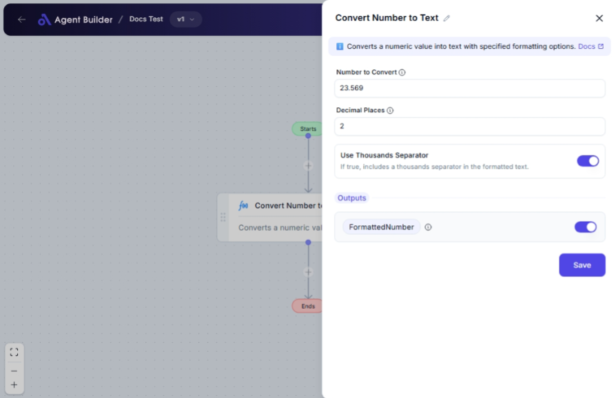

import { Callout, Steps } from "nextra/components";

# Convert Number to Text

The **Convert Number to Text** node allows you to transform a numeric value into a text representation, optionally formatting it with a specified number of decimal places and adding a thousands separator. This functionality can be particularly useful when preparing data for reports, documents, or user interfaces, where numerical values need to be displayed as text.

For example:

- Formatting a number for display in financial reports with commas as thousands separators.
- Converting a precise decimal number to text while specifying the number of decimal places to show.
- Presenting numeric data as readable text in correspondence or user-facing applications.

{/*  */}

## Configuration Options

| Field Name                  | Description                                                    | Input Type | Required? | Default Value |
| --------------------------- | -------------------------------------------------------------- | ---------- | --------- | ------------- |
| **Number to Convert**       | The numeric value to convert to text.                          | Text       | Yes       | _(empty)_     |
| **Decimal Places**          | The number of decimal places to include in the formatted text. | Text       | No        | 2             |
| **Use Thousands Separator** | If true, includes a thousands separator in the formatted text. | Switch     | No        | true          |

## Expected Output Format

The output is a **formatted text string** that represents the numeric value. The text may include commas as thousands separators and a period to denote the decimal places, depending on the configuration options selected.

## Step-by-Step Guide

<Steps>
### Step 1

Add the **Convert Number to Text** node into your flow.

### Step 2

In the **Number to Convert** field, enter the numeric value you wish to convert into text.

### Step 3

Set the **Decimal Places** to specify how many decimal places you want in the resulting text. The default is 2.

### Step 4

Toggle the **Use Thousands Separator** switch to include commas in the formatted text if thousands separators are desired (default is enabled).

### Step 5

The formatted text will display in your flow under **Formatted Number**.

</Steps>

<Callout type="info" title="Tip">
  Use the thousands separator feature to improve the readability of large
  numbers. For example, the number "1234567.89" can be formatted to
  "1,234,567.89" for better clarity.
</Callout>

## Input/Output Examples

| Number to Convert | Decimal Places | Use Thousands Separator | Output Value | Output Type   |
| ----------------- | -------------- | ----------------------- | ------------ | ------------- |
| 1234.56           | 2              | Yes                     | "1,234.56"   | String (Text) |
| 9876.543          | 3              | No                      | "9876.543"   | String (Text) |
| 1000000           | 0              | Yes                     | "1,000,000"  | String (Text) |
| 1234              | 1              | No                      | "1234.0"     | String (Text) |

## Common Mistakes & Troubleshooting

| Problem                                     | Solution                                                                                                                    |
| ------------------------------------------- | --------------------------------------------------------------------------------------------------------------------------- |
| **Non-numeric input in Number to Convert**  | Ensure the value entered is a number. Text and symbols are not supported.                                                   |
| **Unexpected number of decimals in output** | Check the **Decimal Places** setting. This determines how many decimals appear in your formatted text.                      |
| **Thousands Separator not appearing**       | Verify that **Use Thousands Separator** is enabled. If it is off, no commas will be included regardless of the number size. |

## Real-World Use Cases

- **Financial Reporting**: Convert and display financial data as text with appropriate formatting for budgets and forecasts.
- **Data Analysis**: Format numbers with thousands separators to improve readability in large datasets.
- **Customer Invoices**: Convert total amounts to text for invoices and receipts to avoid any ambiguity.
