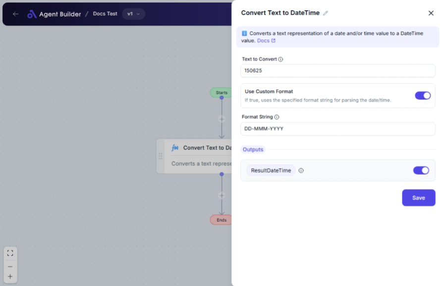

import { Callout, Steps } from "nextra/components";

# Convert Text to DateTime

The **Convert Text to DateTime** node allows you to transform a piece of text into a date and time format. This is especially useful when working with textual data that includes dates or times that you need to manipulate, compare, or use in a chronological sequence.

For example:

- Converting date information from user inputs like "2023-10-05" into a DateTime object.
- Handling date strings in various formats and converting them to DateTime for reporting or scheduling tasks.

## Configuration Options

| Field Name            | Description                                                              | Input Type | Required? | Default Value |
| --------------------- | ------------------------------------------------------------------------ | ---------- | --------- | ------------- |
| **Text to Convert**   | The text value that will be converted to a DateTime.                     | Text       | Yes       | _(empty)_     |
| **Use Custom Format** | If true, uses the specified format string for parsing the date/time.     | Switch     | No        | False         |
| **Format String**     | The format string to use for parsing the date/time (e.g., 'yyyy-MM-dd'). | Text       | No        | _(empty)_     |

- **Result DateTime**: The resulting DateTime value after conversion.

## Expected Output Format

The output of this node is a **DateTime object**, which represents a specific date and time.

## Step-by-Step Guide

<Steps>
### Step 1

Add **Convert Text to DateTime** node into your flow.

### Step 2

In the **Text to Convert** field, enter the text that you want to transform into a DateTime.

### Step 3

If the text format matches a common date pattern, leave the **Use Custom Format** switch off.

### Step 4

If the text requires a specific format to convert properly, turn the **Use Custom Format** switch to the "on" position.

- You will see the **Format String** field appear.
- Enter the specific date format pattern (e.g., `'yyyy-MM-dd'`) that the text follows.

### Step 5

The processed DateTime value will be available as **Result DateTime** for use in other nodes.

</Steps>

<Callout type="info" title="Tip">
  Only specify a **Format String** if your input text follows a unique date
  pattern that needs custom conversion.
</Callout>

## Input/Output Examples

| Input Text    | Use Custom Format | Format String  | Output Value    | Output Type |
| ------------- | ----------------- | -------------- | --------------- | ----------- |
| "2023-10-05"  | No                | _(n/a)_        | DateTime object | DateTime    |
| "05/10/2023"  | Yes               | "dd/MM/yyyy"   | DateTime object | DateTime    |
| "Oct 5, 2023" | Yes               | "MMM dd, yyyy" | DateTime object | DateTime    |

## Common Mistakes & Troubleshooting

| Problem                                       | Solution                                                                       |
| --------------------------------------------- | ------------------------------------------------------------------------------ |
| **Invalid date format**                       | Check if the **Format String** matches the date format of your text exactly.   |
| **No output generated**                       | Ensure that **Text to Convert** is not empty and contains a valid date format. |
| **Input text doesn't match specified format** | Double-check the text value and the format string to ensure they align.        |

## Real-World Use Cases

- **User Registration**: Convert DOB entered as text into a DateTime to validate age or provide birthday reminders.
- **Event Scheduling**: Use date strings from emails to schedule calendar events by converting them to DateTime.
- **Data Analysis**: Convert and sort a list of date strings for timelines or performance reporting.
