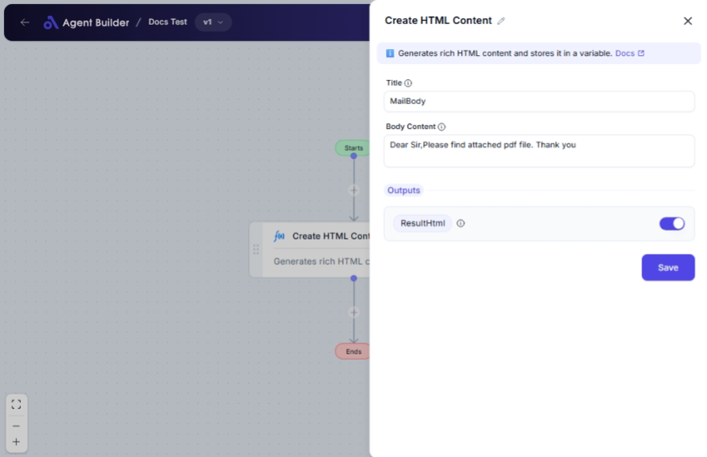

import { Callout, Steps } from "nextra/components";

# Create HTML Content

The **Create HTML Content** node allows you to generate a simple HTML document by specifying the title and body content. This node is useful when you need to create or manipulate HTML content for use in websites, emails, or reports without needing to write HTML code manually.



## Configuration Options

| Field Name       | Description                            | Input Type | Required? | Default Value |
| ---------------- | -------------------------------------- | ---------- | --------- | ------------- |
| **Title**        | The title of the HTML document.        | Text       | Yes       | _(empty)_     |
| **Body Content** | The body content of the HTML document. | Text       | Yes       | _(empty)_     |

## Expected Output Format

The output of this node is a **string containing the complete HTML structure** with a `<title>` element and a `<body>` element. For example:

```html
<html>
  <head>
    <title>Your Title Here</title>
  </head>
  <body>
    Your body content here.
  </body>
</html>
```

## Step-by-Step Guide

<Steps>
### Step 1

Add the **Create HTML Content** node into your flow.

### Step 2

In the **Title** field, enter the desired title for your HTML document. This title will appear in the browser tab when the HTML is viewed.

### Step 3

In the **Body Content** field, input the main content you want to include within your HTML document's body section.

### Step 4

The generated HTML content will be available as **ResultHtml** for use in subsequent nodes or outputs in your flow.

</Steps>

<Callout type="note" title="Note">
  Ensure that both the **Title** and **Body Content** fields are filled out, as
  they are required inputs to generate the HTML.
</Callout>

## Input/Output Examples

| Title       | Body Content      | Output Value                                                                         |
| ----------- | ----------------- | ------------------------------------------------------------------------------------ |
| Hello World | Welcome to XYZ!   | `<html><head><title>Hello World</title></head><body>Welcome to XYZ!</body></html>`   |
| My Web Page | Content goes here | `<html><head><title>My Web Page</title></head><body>Content goes here</body></html>` |

## Common Mistakes & Troubleshooting

| Problem                           | Solution                                                                                      |
| --------------------------------- | --------------------------------------------------------------------------------------------- |
| **Missing Title or Body Content** | Ensure both fields are filled, as they are required to successfully create the HTML document. |
| **HTML not displaying correctly** | Check for any illegal characters in the input fields that may affect HTML structure.          |

## Real-World Use Cases

- **Email Templates**: Quickly create HTML email content that can be sent via email marketing platforms.
- **Web Scraping**: Generate HTML structures for testing web scraping tools or data extraction processes.
- **Template Creation**: Design basic webpage templates for presentations or documentations without coding.
