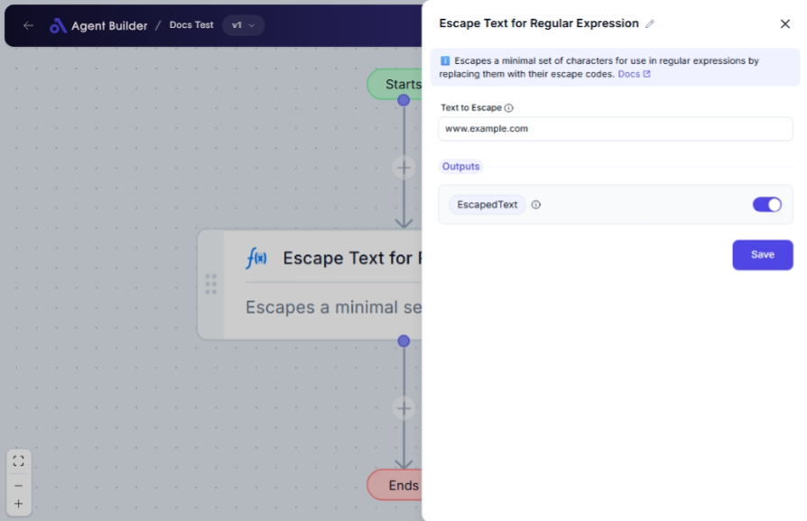

import { Callout, Steps } from "nextra/components";

# Escape Text for Regular Expression

The **Escape Text for Regular Expression** node helps you prepare text for use in regular expressions by escaping special characters. This is useful when you want the text to be interpreted literally in pattern matching, without triggering any special regex commands or operations.

For example, if you need to search for a specific string that includes characters like `.` or `*`, which have special meanings in regex, this node enables you to treat them as normal characters.

{/*  */}

## Configuration Options

| Field Name         | Description                                                                          | Input Type | Required? | Default Value |
| ------------------ | ------------------------------------------------------------------------------------ | ---------- | --------- | ------------- |
| **Text to Escape** | The text value that you want to be safely converted for use in a regular expression. | Text       | Yes       | _(empty)_     |

## Expected Output Format

The output of this node is a **string** where all special characters have been escaped. This ensures the text is treated as literal when used in regular expressions.

For example:

- Input: `example.com`
- Output: `example\.com`

## Step-by-Step Guide

<Steps>
### Step 1

Add the **Escape Text for Regular Expression** node into your flow.

### Step 2

In the **Text to Escape** field, enter the text that you want to prepare for regular expression use.

### Step 3

The node will process the input text, escaping all special regex characters, and provide the result as **Escaped Text**.

### Step 4

Use the **Escaped Text** output in your regex operations as needed.

</Steps>

<Callout type="info" title="Tip">
  Make sure your input in the **Text to Escape** field is the exact text that
  needs literal matching in your regex operations.
</Callout>

## Input/Output Examples

| Input Text  | Output Escaped Text |
| ----------- | ------------------- |
| example.com | example\.com        |
| file_name\* | file_name\*         |
| user^input  | user\^input         |
| (group)?    | \(group\)\?         |

## Common Mistakes & Troubleshooting

| Issue                                | Solution                                                                                                  |
| ------------------------------------ | --------------------------------------------------------------------------------------------------------- |
| **Non-escaped characters in output** | Ensure the correct text is entered in the **Text to Escape** field. Misentry can lead to errors.          |
| **Unexpected regex behavior**        | Double-check that all special characters are escaped in your output if the pattern behaves unpredictably. |

## Real-World Use Cases

- **Data validation**: Use this node to prepare user input that contains special characters for safe validation.
- **Search queries**: Escape user-generated search queries to avoid incorrect matches or errors.
- **Log analysis**: When parsing logs that include regex-sensitive characters, escape them to ensure accurate pattern matching.
